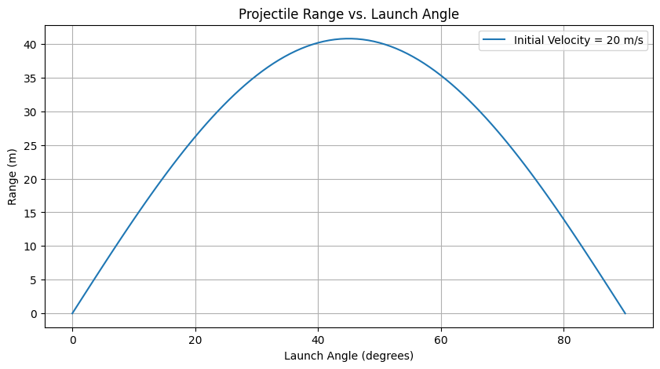

# Problem 1

---
# Investigating the Range as a Function of the Angle of Projection

## 1. Theoretical Foundation

### 1.1 Governing Equations of Motion

Projectile motion is governed by Newton's Second Law of Motion, which states:

$$\mathbf{F}=m\mathbf{a}$$

For a projectile launched with an initial velocity $v_0$ at an angle $\theta$, we decompose the motion into horizontal and vertical components:

#### Horizontal Motion

$$x(t)=v_0\cos\theta\cdot t$$

Since there is no horizontal acceleration (assuming no air resistance), the horizontal velocity remains constant:

$$v_x=v_0\cos\theta$$

#### Vertical Motion

The vertical motion is influenced by gravity $g$, and follows the kinematic equations:

$$y(t)=v_0\sin\theta\cdot t-\frac{1}{2}gt^2$$

The vertical velocity is given by:

$$v_y=v_0\sin\theta-gt$$

At the peak of the trajectory, the vertical velocity becomes zero:

$$0=v_0\sin\theta-gt_{max}$$

Solving for $t_{max}$:

$$t_{max}=\frac{v_0\sin\theta}{g}$$

The total time of flight is twice this value:

$$T=\frac{2v_0\sin\theta}{g}$$

### 1.2 Derivation of the Range Equation

The range $R$ is the horizontal distance traveled when $y=0$. Using the horizontal motion equation:

$$R=v_xT$$

Substituting $v_x=v_0\cos\theta$ and $T=\frac{2v_0\sin\theta}{g}$:

$$R=v_0\cos\theta\cdot\frac{2v_0\sin\theta}{g}$$

Using the trigonometric identity $2\sin\theta\cos\theta=\sin2\theta$, we obtain:

$$R=\frac{v_0^2\sin2\theta}{g}$$

### 1.3 Influence of Initial Conditions

- **Initial Velocity ($v_0$)**: Increasing $v_0$ increases $R$ quadratically.
- **Angle of Projection ($\theta$)**: Maximum range occurs at $\theta=45^\circ$.
- **Gravitational Acceleration ($g$)**: A higher $g$ decreases the range.
- **Launch Height ($h$)**: If launched from a height $h$, the total flight time increases, affecting $R$.

#### Modified Range Equation for Nonzero Initial Height

If the projectile is launched from height $h$, the quadratic equation for time of flight is:

$$y=v_0\sin\theta\cdot t-\frac{1}{2}gt^2+h=0$$

Solving for $t$, we get:

$$t=\frac{v_0\sin\theta+\sqrt{(v_0\sin\theta)^2+2gh}}{g}$$

The range then becomes:

$$R=v_0\cos\theta\cdot\left(\frac{v_0\sin\theta+\sqrt{(v_0\sin\theta)^2+2gh}}{g}\right)$$

This equation accounts for different launch heights, making it more general.

---

## 2. Analysis of the Range

### 2.1 Dependence on the Angle of Projection

The horizontal range $R$ depends on the angle of projection $\theta$ as:

$$R=\frac{v_0^2\sin2\theta}{g}$$

This function is symmetric about $45^\circ$, meaning that complementary angles ($\theta$ and $90^\circ - \theta$) result in the same range. The maximum range occurs when:

$$\theta=45^\circ$$

At this angle, the sine function reaches its maximum value of 1, giving:

$$R_{max}=\frac{v_0^2}{g}$$

### 2.2 Influence of Initial Velocity

From the range equation:

$$R \propto v_0^2$$

This quadratic relationship implies that doubling the initial velocity results in a fourfold increase in range.

### 2.3 Influence of Gravitational Acceleration

Since:

$$R \propto \frac{1}{g}$$

A higher gravitational acceleration reduces the range, which explains why projectiles on the Moon (where $g$ is lower) travel much farther than on Earth.

---

# **3. Practical Applications**

## **3.1 Introduction**

In this section, we explore real-world applications of projectile motion, considering various factors such as uneven terrain and air resistance. These cases require advanced mathematical models beyond the idealized equations of motion.

## **3.2 Projectile Motion on Uneven Terrain**

When a projectile is launched over an uneven surface, its trajectory is influenced by the varying height of the ground. The general equations of motion in the presence of gravity are given by:

$ x=v_0\cos(\theta)t $

$ y=v_0\sin(\theta)t-\frac{1}{2}gt^2 $

However, when the ground is not flat but follows a function $h(x)$, we must solve for the intersection:

$ v_0\sin(\theta)t-\frac{1}{2}gt^2=h(v_0\cos(\theta)t) $

This requires numerical or analytical techniques depending on the complexity of $h(x)$.

## **3.3 Air Resistance in Projectile Motion**

In realistic scenarios, air resistance significantly affects the projectile's motion. The drag force $F_d$ is modeled as:

$$ F_d=\frac{1}{2}C_d\rho A v^2 $$

where:
- $C_d$ is the drag coefficient,
- $\rho$ is the air density,
- $A$ is the cross-sectional area,
- $v$ is the velocity of the projectile.

The motion equations with drag become:

$$ m\frac{dv_x}{dt}=-\frac{1}{2}C_d\rho A v v_x $$

$$ m\frac{dv_y}{dt}=-mg-\frac{1}{2}C_d\rho A v v_y $$

These equations are coupled and typically require numerical integration techniques such as the Runge-Kutta method.

## **3.4 Computational Approaches**

To analyze projectile motion with air resistance or uneven terrain, computational methods are often used. The numerical solution can be obtained using Python or MATLAB, employing:

- Euler’s method
- Runge-Kutta methods
- Finite difference approaches

These allow us to approximate the trajectory efficiently.

## **3.5 Conclusion**

Practical projectile motion problems require considering additional forces and irregular surfaces. Understanding these factors is crucial in fields like aerospace engineering, ballistics, and sports science. The combination of analytical and computational approaches provides deeper insights into real-world projectile dynamics.

##  **4. python/ plot**




```python


import numpy as np
import matplotlib.pyplot as plt

def projectile_range(v0, angle, g=9.81):
    """
    Compute the range of a projectile given initial velocity and launch angle.
    :param v0: Initial velocity (m/s)
    :param angle: Launch angle (degrees)
    :param g: Acceleration due to gravity (m/s^2), default is Earth gravity
    :return: Range of the projectile (m)
    """
    theta = np.radians(angle)
    return (v0**2 * np.sin(2 * theta)) / g

def plot_range(v0, g=9.81):
    """ Plot range as a function of launch angle. """
    angles = np.linspace(0, 90, num=100)  # Angles from 0 to 90 degrees
    ranges = [projectile_range(v0, angle, g) for angle in angles]
    
    plt.figure(figsize=(10, 5))
    plt.plot(angles, ranges, label=f'Initial Velocity = {v0} m/s')
    plt.xlabel('Launch Angle (degrees)')
    plt.ylabel('Range (m)')
    plt.title('Projectile Range vs. Launch Angle')
    plt.legend()
    plt.grid()
    plt.show()

# Parameters
v0 = 20  # Initial velocity in m/s

# Run simulation

plot_range(v0)

```


[def]: image.png