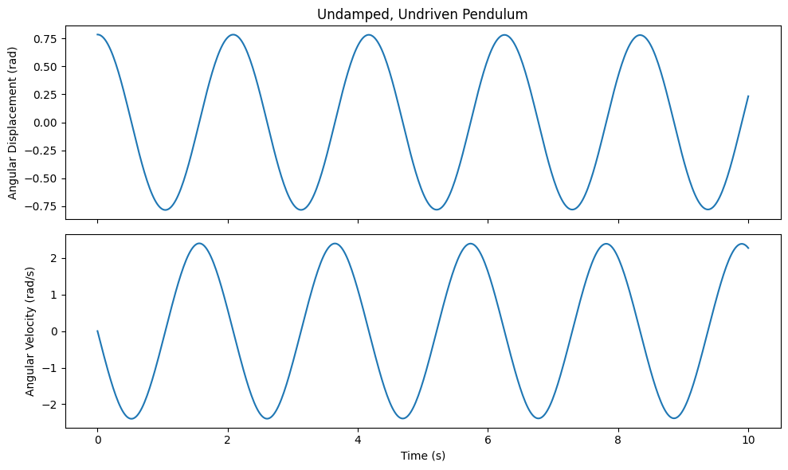
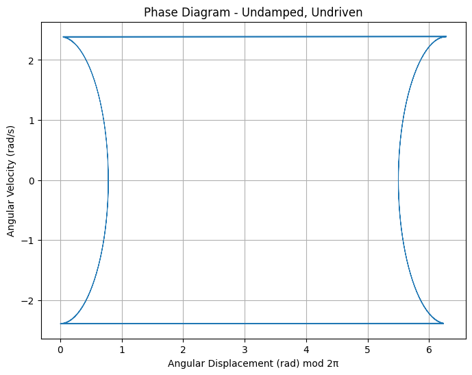
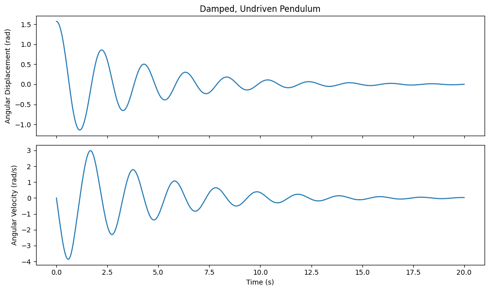
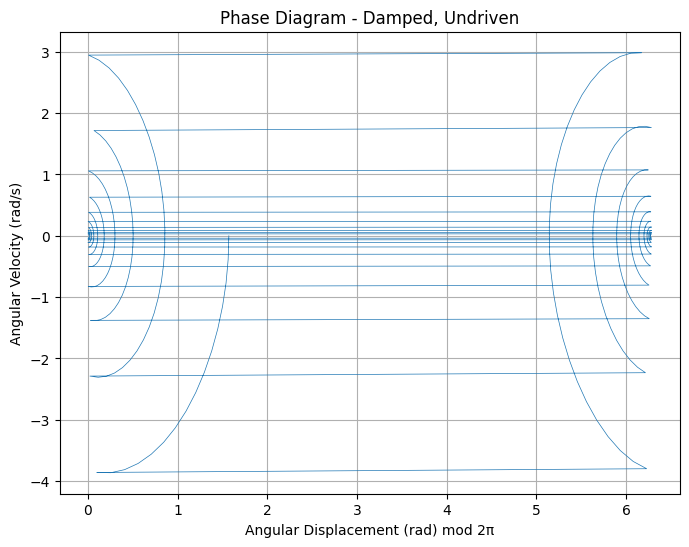
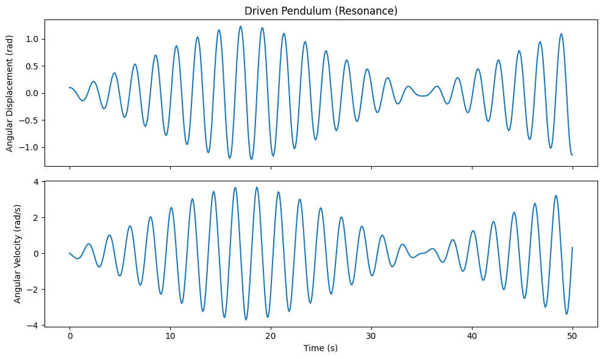
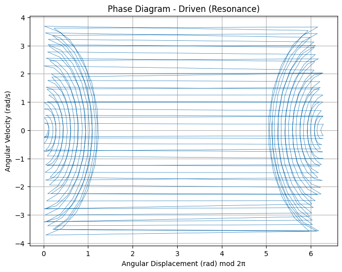
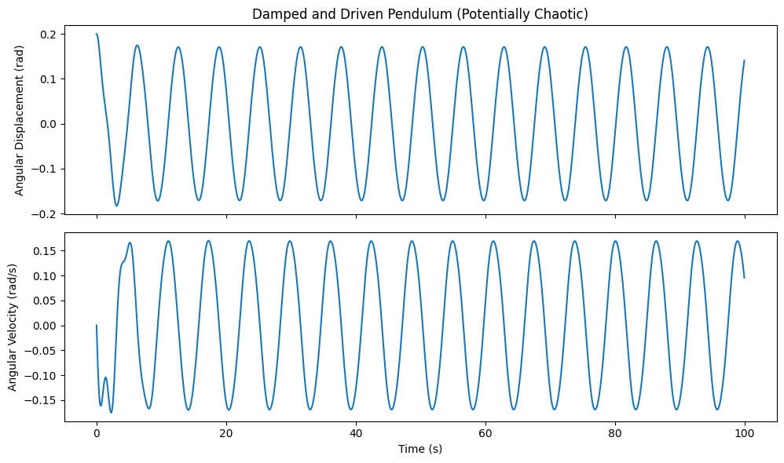
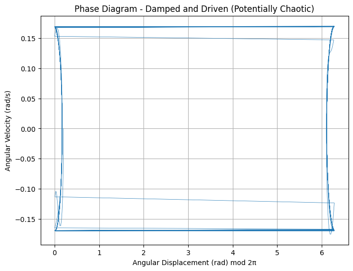
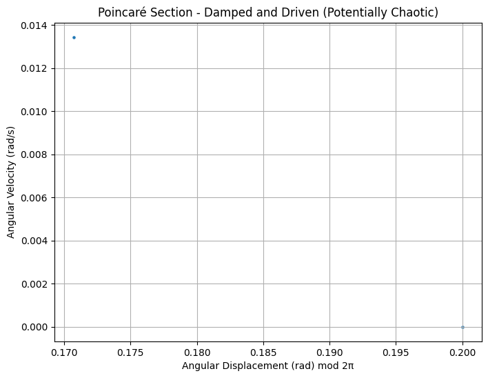
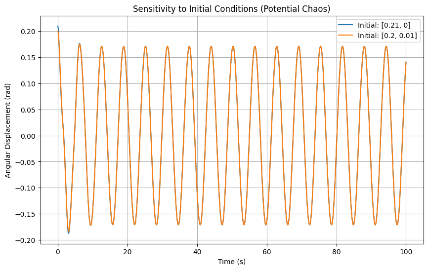

# Problem 2
# 📚 Theoretical Foundation of the Forced Damped Pendulum

## 1️⃣ Formulating the Differential Equation for the Forced Damped Pendulum ⚖️

The motion of a forced damped pendulum can be described using Newton's Second Law:

$$mL\frac{d^2\theta}{dt^2}+b\frac{d\theta}{dt}+mg\sin\theta=F_0\cos(\omega t)$$

where:
- $m$ is the mass of the pendulum,
- $L$ is the length of the pendulum,
- $b$ is the damping coefficient,
- $g$ is the acceleration due to gravity,
- $F_0$ is the amplitude of the external driving force,
- $\omega$ is the driving frequency,
- $\theta$ is the angular displacement.

Dividing through by $mL$:

$$\frac{d^2\theta}{dt^2}+\frac{b}{mL}\frac{d\theta}{dt}+\frac{g}{L}\sin\theta=\frac{F_0}{mL}\cos(\omega t)$$

To make the equation more manageable, we define dimensionless parameters:
- $\gamma=\frac{b}{mL}$ (damping ratio, representing the effect of friction),
- $\omega_0^2=\frac{g}{L}$ (square of the natural frequency, characterizing the system's oscillation rate),
- $f=\frac{F_0}{mL}$ (scaled external force).

This leads to the simplified equation:

$$\ddot{\theta}+\gamma\dot{\theta}+\omega_0^2\sin\theta=f\cos(\omega t)$$

## 2️⃣ Approximate Solutions for Small-Angle Oscillations 🔬

For small angles ($\theta\approx\sin\theta$), we can linearize the equation:

$$\ddot{\theta}+\gamma\dot{\theta}+\omega_0^2\theta=f\cos(\omega t)$$

This equation describes a **damped, driven harmonic oscillator**. Using the method of undetermined coefficients, we assume the steady-state solution is of the form:

$$\theta(t)=A\cos(\omega t-\delta)$$

where:

- **Amplitude** $A$ determines the system's response to the driving force:
  
  $$A=\frac{f}{\sqrt{(\omega_0^2-\omega^2)^2+\gamma^2\omega^2}}$$

- **Phase shift** $\delta$ accounts for the lag due to damping:
  
  $$\tan\delta=\frac{\gamma\omega}{\omega_0^2-\omega^2}$$

This means the oscillations **lag behind the external force**, with the delay increasing as damping grows.

## 3️⃣ Analysis of Resonance Conditions and Energy Impact 🎵⚡

### 🌟 Resonance: When the System Responds Most Strongly

Resonance occurs when the driving frequency matches the system's natural frequency:

$$\omega\approx\omega_0$$

At this point, the denominator of $A$ approaches zero, leading to a **large increase in oscillation amplitude**. In real-world systems, damping prevents infinite amplitude but still allows significant oscillations.

### 🔋 Energy Considerations
The total mechanical energy of the pendulum consists of kinetic and potential energy:

$$E=T+U=\frac{1}{2}mL^2\dot{\theta}^2+mgL(1-\cos\theta)$$

For small oscillations, this simplifies to:

$$E\approx\frac{1}{2}mL^2\dot{\theta}^2+\frac{1}{2}mgL\theta^2$$

Under steady-state forced oscillations, energy input from the external force **balances** the dissipation due to damping. This results in a periodic exchange of energy within the system.

---
## 📌 Summary 📝
- The forced damped pendulum obeys a nonlinear differential equation, which simplifies under small-angle assumptions.
- Its behavior is characterized by damping, external driving forces, and resonance effects.
- Resonance occurs when the driving frequency approaches the natural frequency, leading to large oscillations.
- The system's energy oscillates due to an external force counteracting damping losses.

These principles are crucial in engineering, physics, and even biological systems (e.g., heart rhythms, bridges swaying). Understanding them helps in designing **stable** and **efficient** mechanical systems! 🚀

# 🔍 Analysis of Dynamics

## ⚖️ 2.1 Influence of Damping Coefficient

The equation of motion for a damped driven system is given by:

$$m\ddot{x} + b\dot{x} + kx = F_0\cos(\omega t)$$

where:
- $m$ is the mass of the system, determining inertia.
- $b$ is the damping coefficient, controlling resistance to motion.
- $k$ is the spring constant, representing restoring force.
- $F_0$ is the external driving amplitude.
- $\omega$ is the driving frequency.

### 🔬 Types of Damping
- **Underdamping** ($b^2<4mk$): System oscillates with decreasing amplitude over time.
- **Critical damping** ($b^2=4mk$): System returns to equilibrium as fast as possible without oscillating.
- **Overdamping** ($b^2>4mk$): System slowly returns to equilibrium without oscillation.

The **quality factor** $Q$ measures how underdamped a system is:

$$Q=\frac{m\omega_0}{b}$$

where $\omega_0=\sqrt{k/m}$ is the natural frequency. High $Q$ means low damping and more oscillations.

## 📈 2.2 Influence of Driving Amplitude

When the system is driven externally, the steady-state amplitude follows:

$$A=\frac{F_0/m}{\sqrt{(\omega_0^2-\omega^2)^2+(b\omega/m)^2}}$$

- **Small $F_0$:** Response is proportional to the force (linear behavior).
- **At resonance ($\omega=\omega_0$):** Amplitude reaches a peak.
- **High $F_0$:** Nonlinear effects and potential chaotic motion emerge.

## 🎶 2.3 Influence of Driving Frequency

The system's response changes with frequency $\omega$:
- **Low-frequency regime** ($\omega\ll\omega_0$): The system follows the driving force smoothly.
- **Near resonance** ($\omega\approx\omega_0$): Maximum amplitude occurs due to resonance.
- **High-frequency regime** ($\omega\gg\omega_0$): The system cannot keep up with the driving force, resulting in reduced response.

The phase lag $\phi$ between the driving force and displacement is:

$$\tan\phi=\frac{b\omega}{m(\omega_0^2-\omega^2)}$$

## 🔀 2.4 Transition Between Regular and Chaotic Motion

For nonlinear driven systems, such as the Duffing oscillator:

$$m\ddot{x} + b\dot{x} + kx + \alpha x^3 = F_0\cos(\omega t)$$

where $\alpha$ introduces nonlinearity. The system can exhibit:
- **Periodic motion**: Regular oscillations with predictable behavior.
- **Quasiperiodic motion**: Oscillations with multiple incommensurate frequencies.
- **Chaotic motion**: Unpredictable behavior with extreme sensitivity to initial conditions.

### 📊 Lyapunov Exponent
A key indicator of chaos is the Lyapunov exponent $\lambda$:

$$\lambda=\lim_{t\to\infty} \frac{1}{t} \ln \frac{|\delta x(t)|}{|\delta x(0)|}$$

- If $\lambda>0$, the system is **chaotic**.
- If $\lambda<0$, the system is **stable and predictable**.

### 🌀 Poincaré Section
A visualization technique for chaos:
- **Regular motion** forms closed loops.
- **Chaotic motion** forms scattered, fractal-like structures.

## 🌍 2.5 Physical Significance
- **🚗 Engineering:** Used in shock absorbers and mechanical resonance analysis.
- **🌦️ Climate Models:** Helps predict weather patterns and turbulence.
- **🧠 Biological Systems:** Found in heart rhythms and neural oscillations.
- **🪐 Astronomy:** Governs planetary motion, stability, and celestial mechanics.

---
### 📝 Summary
- The behavior of oscillatory systems depends on damping, driving force, and frequency.
- Resonance amplifies oscillations but can also lead to instability.
- Nonlinearities introduce complex behaviors, including chaos.
- Chaos is characterized by sensitivity to initial conditions, analyzed via Lyapunov exponents and Poincare sections.

This document provides a detailed mathematical and conceptual framework for analyzing dynamical systems, emphasizing the transition from **order to chaos**.


# 🔬 Practical Applications of Oscillatory Systems ⚙️

Oscillatory systems play a crucial role in various engineering and scientific disciplines, governing the behavior of mechanical structures, electrical circuits, and energy harvesting technologies. By understanding these systems, engineers can design safer bridges, efficient energy systems, and optimized electronic devices. This section explores some key real-world applications, including energy harvesting, suspension bridges, and oscillating circuits.

## ⚡ 1. Energy Harvesting

Energy harvesting technologies utilize oscillatory and vibrational motions to generate electrical energy from ambient sources such as vibrations, thermal fluctuations, or mechanical motion. These systems often employ piezoelectric, electromagnetic, or electrostatic transduction mechanisms.

The governing equation for a simple electromechanical energy harvester is given by:

$$m\ddot{x}+c\dot{x}+kx=F_{ext}(t)$$

where:
- $m$ is the mass of the oscillating system,
- $c$ is the damping coefficient,
- $k$ is the stiffness constant,
- $F_{ext}(t)$ represents the external excitation force.

By incorporating an electromechanical coupling term, the output voltage $V$ across a piezoelectric material is given by:

$$V=\frac{d_{31}F_{ext}(t)}{C_p}$$

where:
- $d_{31}$ is the piezoelectric charge constant,
- $C_p$ is the capacitance of the piezoelectric element.

**Applications:**

- Powering remote sensors in industrial and environmental monitoring.

- Harvesting kinetic energy from human motion for wearable electronics.

- Utilizing ocean wave energy for renewable power generation.

## 🌉 2. Suspension Bridges

Suspension bridges are subject to oscillatory forces from wind, traffic loads, and seismic activity. The famous case of the **Tacoma Narrows Bridge collapse** in 1940 illustrates the importance of understanding resonance effects in structural engineering.

The equation governing small oscillations of a bridge modeled as a beam is:

$$EI\frac{\partial^4 y}{\partial x^4}+m\frac{\partial^2 y}{\partial t^2}+c\frac{\partial y}{\partial t}=F_{wind}(t)$$

where:
- $E$ is Young’s modulus (material stiffness),
- $I$ is the second moment of area (beam shape factor),
- $m$ is the mass per unit length,
- $c$ is the damping coefficient,
- $F_{wind}(t)$ represents wind-induced forcing.

For stability, damping must be introduced to prevent resonance when the natural frequency $\omega_n$ matches the forcing frequency:

$$\omega_n=\sqrt{\frac{k}{m}}$$

**Applications:**
- Design of earthquake-resistant bridges.
- Optimization of bridge materials to reduce vibration amplitudes.
- Wind tunnel testing for aerodynamically stable structures.

## 🔌 3. Oscillating Circuits

Electrical circuits containing inductors, capacitors, and resistors exhibit oscillatory behavior essential in communication systems, signal processing, and power electronics. The standard RLC circuit equation follows from Kirchhoff’s voltage law:

$$L\frac{d^2 q}{d t^2}+R\frac{d q}{d t}+\frac{q}{C}=0$$

where:
- $L$ is the inductance,
- $R$ is the resistance,
- $C$ is the capacitance,
- $q$ is the charge on the capacitor.

The characteristic equation of the circuit is:

$$s^2+\frac{R}{L}s+\frac{1}{LC}=0$$

Solving for $s$, the damping factor $\zeta$ determines whether the circuit is overdamped, underdamped, or critically damped:

$$\zeta=\frac{R}{2}\sqrt{\frac{C}{L}}$$

**Applications:**
- Design of radio frequency (RF) filters in communication devices.
- Stability analysis of power supply circuits.
- Development of resonant transformers and wireless charging systems.

## 🏆 Summary

Oscillatory systems are fundamental to many engineering applications, from structural mechanics to electronic circuit design and renewable energy solutions. Understanding their behavior through mathematical modeling allows for the **optimization of structures and devices** ,ensuring:
✅ Stability against external perturbations.
✅ Efficiency in energy conversion processes.
✅ Performance improvement in electronic and mechanical systems.

By mastering the principles of oscillatory dynamics, engineers and scientists can develop **safer, more efficient, and innovative** solutions to real-world challenges.


## Python/ plot





















```python
import numpy as np
import matplotlib.pyplot as plt
from scipy.integrate import solve_ivp

# Define the parameters of the pendulum
g = 9.81  # Acceleration due to gravity (m/s^2)
L = 1.0   # Length of the pendulum (m)
m = 1.0   # Mass of the pendulum bob (kg)

def pendulum_equations(t, y, b, F_ext, omega_d):
    """
    Defines the differential equations for the damped and driven pendulum.

    Args:
        t: Time.
        y: A list or array containing [theta, omega].
        b: Damping coefficient.
        F_ext: Amplitude of the external driving force.
        omega_d: Angular frequency of the driving force.

    Returns:
        A list or array containing [dtheta/dt, domega/dt].
    """
    theta, omega = y
    dtheta_dt = omega
    domega_dt = -(b/m) * omega - (g/L) * np.sin(theta) + F_ext * np.cos(omega_d * t)
    return [dtheta_dt, domega_dt]

def simulate_pendulum(initial_conditions, time_span, params, num_points=500):
    """
    Simulates the pendulum's motion using solve_ivp.

    Args:
        initial_conditions: A list or array [theta0, omega0].
        time_span: A tuple (t_start, t_end).
        params: A dictionary containing 'b', 'F_ext', 'omega_d'.
        num_points: Number of time points for the solution.

    Returns:
        A tuple containing the time array and the solution array (theta, omega).
    """
    sol = solve_ivp(pendulum_equations, time_span, initial_conditions,
                    args=(params['b'], params['F_ext'], params['omega_d']),
                    dense_output=True)
    t = np.linspace(time_span[0], time_span[1], num_points)
    theta, omega = sol.sol(t)
    return t, theta, omega

def plot_motion(t, theta, omega, title="Pendulum Motion"):
    """Plots the angular displacement and angular velocity over time."""
    fig, axs = plt.subplots(2, 1, sharex=True, figsize=(10, 6))
    axs[0].plot(t, theta)
    axs[0].set_ylabel('Angular Displacement (rad)')
    axs[1].plot(t, omega)
    axs[1].set_ylabel('Angular Velocity (rad/s)')
    axs[1].set_xlabel('Time (s)')
    axs[0].set_title(title)
    plt.tight_layout()
    plt.show()

def plot_phase_diagram(theta, omega, title="Phase Diagram"):
    """Plots the phase diagram (omega vs theta)."""
    plt.figure(figsize=(8, 6))
    plt.plot(theta % (2 * np.pi), omega, lw=0.5)  # Modulo 2*pi to see the pattern clearly
    plt.xlabel('Angular Displacement (rad) mod 2π')
    plt.ylabel('Angular Velocity (rad/s)')
    plt.title(title)
    plt.grid(True)
    plt.show()

def poincare_section(t, theta, omega, driving_period, title="Poincaré Section"):
    """Generates the Poincaré section by sampling at integer multiples of the driving period."""
    indices = np.where(np.isclose(t % driving_period, 0.0, atol=1e-3))[0]
    theta_poincare = theta[indices] % (2 * np.pi)
    omega_poincare = omega[indices]
    plt.figure(figsize=(8, 6))
    plt.scatter(theta_poincare, omega_poincare, s=5)
    plt.xlabel('Angular Displacement (rad) mod 2π')
    plt.ylabel('Angular Velocity (rad/s)')
    plt.title(title)
    plt.grid(True)
    plt.show()

# --- Simulations ---

# 1. Undamped, Undriven Pendulum (Simple Harmonic Motion)
params_undamped = {'b': 0, 'F_ext': 0, 'omega_d': 0}
initial_undamped = [np.pi/4, 0]  # Initial displacement, initial velocity
time_undamped = (0, 10)
t_undamped, theta_undamped, omega_undamped = simulate_pendulum(initial_undamped, time_undamped, params_undamped)
plot_motion(t_undamped, theta_undamped, omega_undamped, title="Undamped, Undriven Pendulum")
plot_phase_diagram(theta_undamped, omega_undamped, title="Phase Diagram - Undamped, Undriven")

# 2. Damped, Undriven Pendulum
params_damped = {'b': 0.5, 'F_ext': 0, 'omega_d': 0}
initial_damped = [np.pi/2, 0]
time_damped = (0, 20)
t_damped, theta_damped, omega_damped = simulate_pendulum(initial_damped, time_damped, params_damped)
plot_motion(t_damped, theta_damped, omega_damped, title="Damped, Undriven Pendulum")
plot_phase_diagram(theta_damped, omega_damped, title="Phase Diagram - Damped, Undriven")

# 3. Driven Pendulum (Without Damping) - Exploring Resonance
params_driven_res = {'b': 0, 'F_ext': 0.5, 'omega_d': np.sqrt(g/L)} # Driving frequency near natural frequency
initial_driven_res = [0.1, 0]
time_driven_res = (0, 50)
t_driven_res, theta_driven_res, omega_driven_res = simulate_pendulum(initial_driven_res, time_driven_res, params_driven_res)
plot_motion(t_driven_res, theta_driven_res, omega_driven_res, title="Driven Pendulum (Resonance)")
plot_phase_diagram(theta_driven_res, omega_driven_res, title="Phase Diagram - Driven (Resonance)")

# 4. Damped and Driven Pendulum - Exploring Chaos
params_chaos = {'b': 0.5, 'F_ext': 1.5, 'omega_d': 1.0}
initial_chaos = [0.2, 0]
time_chaos = (0, 100)
t_chaos, theta_chaos, omega_chaos = simulate_pendulum(initial_chaos, time_chaos, params_chaos, num_points=1000)
plot_motion(t_chaos, theta_chaos, omega_chaos, title="Damped and Driven Pendulum (Potentially Chaotic)")
plot_phase_diagram(theta_chaos, omega_chaos, title="Phase Diagram - Damped and Driven (Potentially Chaotic)")

# Poincaré Section for the potentially chaotic case
driving_period_chaos = 2 * np.pi / params_chaos['omega_d']
poincare_section(t_chaos, theta_chaos, omega_chaos, driving_period_chaos, title="Poincaré Section - Damped and Driven (Potentially Chaotic)")

# 5. Exploring different initial conditions for the chaotic case
params_chaos_alt_init = {'b': 0.5, 'F_ext': 1.5, 'omega_d': 1.0}
initial_chaos_alt1 = [0.21, 0]
initial_chaos_alt2 = [0.2, 0.01]
time_chaos_alt = (0, 100)
t_chaos_alt, theta_chaos_alt1, omega_chaos_alt1 = simulate_pendulum(initial_chaos_alt1, time_chaos_alt, params_chaos_alt_init, num_points=1000)
_, theta_chaos_alt2, omega_chaos_alt2 = simulate_pendulum(initial_chaos_alt2, time_chaos_alt, params_chaos_alt_init, num_points=1000)

plt.figure(figsize=(10, 6))
plt.plot(t_chaos_alt, theta_chaos_alt1, label='Initial: [0.21, 0]')
plt.plot(t_chaos_alt, theta_chaos_alt2, label='Initial: [0.2, 0.01]')
plt.xlabel('Time (s)')
plt.ylabel('Angular Displacement (rad)')
plt.title('Sensitivity to Initial Conditions (Potential Chaos)')
plt.legend()
plt.grid(True)
plt.show()

```

link:[colab](https://colab.research.google.com/drive/1xQxxf2nBRNmZiK03xTnXA2gYWNoZC7CI?usp=sharing)