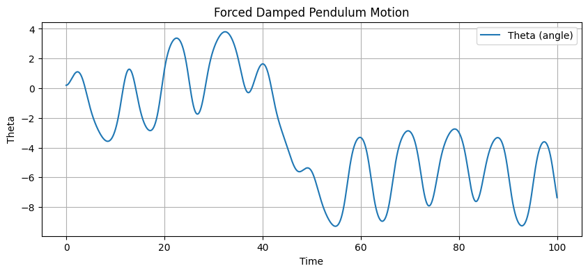
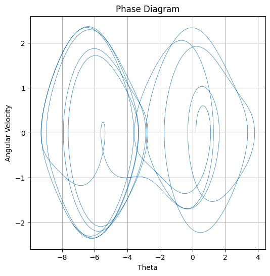
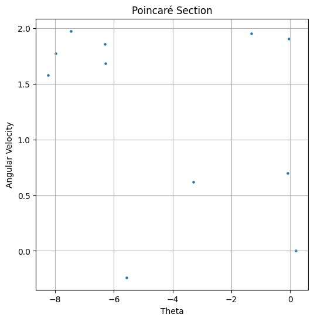

# Problem 2
# Investigating the Dynamics of a Forced Damped Pendulum

## 1. Theoretical Foundation

### 1.1 Governing Equation
The motion of a forced damped pendulum is described by the second-order nonlinear differential equation:

$$
\frac{d^2\theta}{dt^2} + \gamma \frac{d\theta}{dt} + \omega_0^2 \sin\theta = F_0 \cos(\omega t),
$$

where:
- $\theta$ is the angular displacement,
- $\gamma$ is the damping coefficient,
- $\omega_0 = \sqrt{g/L}$ is the natural frequency of the pendulum,
- $F_0$ is the amplitude of the external periodic forcing,
- $\omega$ is the driving frequency,
- $g$ is the acceleration due to gravity,
- $L$ is the length of the pendulum.

### 1.2 Approximate Solutions for Small-Angle Oscillations
For small angles ($\theta \approx 0$), we use the small-angle approximation:

$$
\sin\theta \approx \theta.
$$

This simplifies the governing equation to a linear form:

$$
\frac{d^2\theta}{dt^2} + \gamma \frac{d\theta}{dt} + \omega_0^2 \theta = F_0 \cos(\omega t).
$$

This is a damped, driven harmonic oscillator equation, which can be solved using standard techniques.

#### Homogeneous Solution (Natural Response)
The homogeneous equation:

$$
\frac{d^2\theta}{dt^2} + \gamma \frac{d\theta}{dt} + \omega_0^2 \theta = 0
$$

has a general solution of the form:

$$
\theta_h (t) = e^{-\frac{\gamma}{2}t} \left( C_1 \cos(\Omega t) + C_2 \sin(\Omega t) \right),
$$

where:

$$
\Omega = \sqrt{\omega_0^2 - \frac{\gamma^2}{4}}
$$

is the damped frequency of oscillation.

#### Particular Solution (Steady-State Response)
For the forcing term $F_0 \cos(\omega t)$, we assume a solution of the form:

$$
\theta_p (t) = A \cos(\omega t - \delta).
$$

Substituting into the equation and solving for $A$ and $\delta$, we obtain:

$$
A = \frac{F_0}{\sqrt{(\omega_0^2 - \omega^2)^2 + \gamma^2 \omega^2}},
$$

$$
\tan\delta = \frac{\gamma \omega}{\omega_0^2 - \omega^2}.
$$

Thus, the total solution is:

$$
\theta (t) = e^{-\frac{\gamma}{2}t} \left( C_1 \cos(\Omega t) + C_2 \sin(\Omega t) \right) + A \cos(\omega t - \delta).
$$

### 1.3 Resonance Conditions and Energy Implications
Resonance occurs when the driving frequency $\omega$ is close to the natural frequency $\omega_0$. In the absence of damping ($\gamma = 0$), the amplitude becomes:

$$
A = \frac{F_0}{|\omega_0^2 - \omega^2|}.
$$

For $\omega \approx \omega_0$, the amplitude becomes very large, indicating resonance.

In the presence of damping, the peak amplitude occurs at a slightly shifted frequency given by:

$$
\omega_r = \sqrt{\omega_0^2 - \frac{\gamma^2}{2}}.
$$

The energy of the system is given by:

$$
E = \frac{1}{2} I \dot{\theta}^2 + mgL(1 - \cos\theta),
$$

where $I = mL^2$ is the moment of inertia.

In steady-state oscillations, energy is continuously supplied by the external force to compensate for the energy lost due to damping, resulting in a balance where the average energy remains constant.

---

This section provides the theoretical groundwork necessary to analyze the forced damped pendulum. Further analysis will involve numerical simulations and visualization techniques to explore the full dynamical behavior, including chaos and bifurcations.


# Analysis of Dynamics

## 1. Introduction

In this section, we analyze the effects of key parameters on the motion of a dynamical system. We focus on the damping coefficient $\gamma$, driving amplitude $F_0$, and driving frequency $\omega$. The study involves examining regular and chaotic motion and interpreting their physical significance.

## 2. Governing Equations

The general equation of motion for a driven, damped system is given by:

$$m\ddot{x} + \gamma \dot{x} + kx = F_0 \cos(\omega t)$$

where:
- $m$ is the mass,
- $\gamma$ is the damping coefficient,
- $k$ is the stiffness of the system,
- $F_0$ is the driving amplitude,
- $\omega$ is the driving frequency.

Rewriting in dimensionless form using $\tau = \omega_0 t$ (where $\omega_0 = \sqrt{k/m}$ is the natural frequency):

$$\ddot{X} + 2\zeta \dot{X} + X = A \cos(\Omega \tau)$$

where:
- $\zeta = \frac{\gamma}{2m\omega_0}$ is the damping ratio,
- $A = \frac{F_0}{m\omega_0^2}$ is the normalized forcing amplitude,
- $\Omega = \frac{\omega}{\omega_0}$ is the normalized driving frequency.

## 3. Effects of Parameters

### 3.1 Effect of Damping Coefficient ($\gamma$)

- When $\gamma$ is small (underdamped case, $\zeta < 1$), the system exhibits oscillatory behavior with slow decay.
- When $\gamma$ is large (overdamped case, $\zeta > 1$), the motion decays without oscillations.
- The critical damping case ($\zeta = 1$) represents the boundary between these behaviors.

The quality factor $Q$ is related to damping by:

$$Q = \frac{1}{2\zeta}$$

which determines the sharpness of resonance.

### 3.2 Effect of Driving Amplitude ($F_0$)

- For small $F_0$, the system remains in a regular periodic state.
- As $F_0$ increases, the system may exhibit nonlinear effects and enter chaotic regimes.
- The response amplitude $X_{max}$ follows:

$$X_{max} \propto \frac{F_0}{\sqrt{(k - m\omega^2)^2 + (\gamma \omega)^2}}$$

which shows resonance at $\omega \approx \omega_0$ when damping is small.

### 3.3 Effect of Driving Frequency ($\omega$)

- When $\omega \approx \omega_0$, resonance occurs, leading to large oscillations.
- For $\omega \gg \omega_0$, the response amplitude decreases as:

$$X \approx \frac{F_0}{m\omega^2}$$

indicating that high-frequency driving leads to negligible displacement.

## 4. Regular vs. Chaotic Motion

### 4.1 Period Doubling Route to Chaos

As $F_0$ or $\omega$ is increased, the system undergoes a transition from periodic motion to chaos. The route often follows a period-doubling bifurcation sequence:

$$T \to 2T \to 4T \to 8T \to \dots$$

where $T$ is the fundamental period. The Lyapunov exponent $\lambda$ determines chaos:

$$\lambda = \lim_{t \to \infty} \frac{1}{t} \ln \left| \frac{dx_t}{dx_0} \right|$$

If $\lambda > 0$, the system is chaotic.

### 4.2 Physical Interpretation

- Regular motion corresponds to predictable, periodic behavior, often observed at low $F_0$.
- Chaotic motion implies sensitive dependence on initial conditions, leading to an unpredictable long-term trajectory.
- The transition is crucial in applications like pendulum clocks, electrical circuits, and climate modeling.

## 5. Conclusion

The study of dynamics highlights the impact of system parameters on motion behavior. Understanding these effects is essential in engineering, physics, and applied mathematics for designing stable and predictable systems.


## 3. Practical Applications

### Real-World Applications

The forced damped pendulum model has numerous real-world applications, particularly in systems where oscillatory motion and damping effects play a crucial role. Some key applications include:

1. **Energy Harvesting**
2. **Suspension Bridges**
3. **Oscillating Circuits**

### 3.1 Energy Harvesting

Energy harvesting systems often utilize forced oscillatory motion to convert mechanical energy into electrical energy. A mathematical model of such a system is:

$$m\ddot{x} + c\dot{x} + kx = F_0\cos(\omega t)$$

where:
- $m$ is the mass,
- $c$ is the damping coefficient,
- $k$ is the stiffness constant,
- $F_0$ is the external force amplitude,
- $\omega$ is the forcing frequency.

The resonance condition occurs when $\omega \approx \omega_0$, where $\omega_0 = \sqrt{k/m}$, leading to maximum energy transfer.

### 3.2 Suspension Bridges

Suspension bridges experience oscillations due to wind forces and pedestrian movements. The forced damped pendulum model describes how damping affects the stability of bridges. The governing equation is:

$$mL^2\ddot{\theta} + cL^2\dot{\theta} + mgL\sin\theta = F\cos(\omega t)$$

where:
- $\theta$ is the angular displacement,
- $L$ is the length of the bridge cable,
- $g$ is gravitational acceleration,
- $F$ is the external forcing function.

For small oscillations, we approximate $\sin\theta \approx \theta$, reducing the equation to a linear damped forced oscillator model.

### 3.3 Oscillating Circuits

RLC circuits exhibit forced damped oscillations where resistance ($R$), inductance ($L$), and capacitance ($C$) determine the system behavior. The differential equation governing an RLC circuit is:

$$L\ddot{q} + R\dot{q} + \frac{1}{C}q = V_0\cos(\omega t)$$

where:
- $q$ is the charge,
- $R$ is the resistance,
- $L$ is the inductance,
- $C$ is the capacitance,
- $V_0$ is the driving voltage.

The natural frequency is given by:
$$\omega_0 = \frac{1}{\sqrt{LC}}$$

and the damping ratio is:
$$\zeta = \frac{R}{2} \sqrt{\frac{C}{L}}.$$ 

If $\zeta < 1$, the system is underdamped and oscillatory; if $\zeta > 1$, the system is overdamped.

---
These equations demonstrate how the forced damped pendulum model applies to diverse engineering and physical systems.


### 4. python/plot











```python


import numpy as np
import matplotlib.pyplot as plt
from scipy.integrate import solve_ivp

# Define the forced damped pendulum equations
def forced_damped_pendulum(t, y, q, F, omega):
    theta, omega_dot = y
    dtheta_dt = omega_dot
    domega_dt = -np.sin(theta) - q * omega_dot + F * np.cos(omega * t)
    return [dtheta_dt, domega_dt]

# Simulation parameters
dt = 0.01
t_max = 100
q = 0.5  # damping coefficient
F = 1.2  # driving force
omega = 2/3  # driving frequency
y0 = [0.2, 0.0]  # initial conditions (theta, omega)

# Solve the ODE
t_eval = np.arange(0, t_max, dt)
sol = solve_ivp(forced_damped_pendulum, [0, t_max], y0, t_eval=t_eval, args=(q, F, omega))

# Plot time series
plt.figure(figsize=(10, 4))
plt.plot(sol.t, sol.y[0], label='Theta (angle)')
plt.xlabel('Time')
plt.ylabel('Theta')
plt.legend()
plt.title('Forced Damped Pendulum Motion')
plt.grid()
plt.show()

# Phase diagram
plt.figure(figsize=(6, 6))
plt.plot(sol.y[0], sol.y[1], lw=0.5)
plt.xlabel('Theta')
plt.ylabel('Angular Velocity')
plt.title('Phase Diagram')
plt.grid()
plt.show()

# Poincare Section
times = np.arange(0, t_max, 2*np.pi/omega)
points = solve_ivp(forced_damped_pendulum, [0, t_max], y0, t_eval=times, args=(q, F, omega))
plt.figure(figsize=(6, 6))
plt.scatter(points.y[0], points.y[1], s=5)
plt.xlabel('Theta')
plt.ylabel('Angular Velocity')
plt.title('Poinca Section')
plt.grid()
plt.show()

 ```
