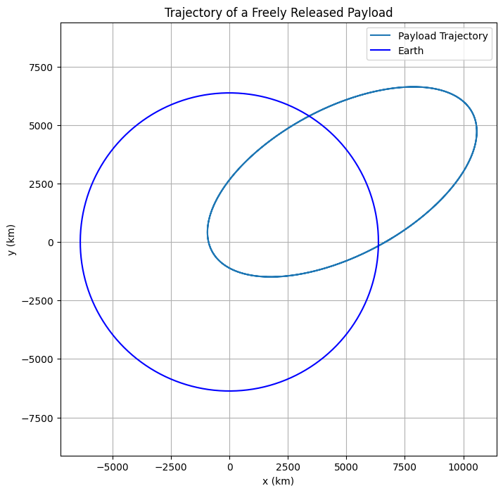
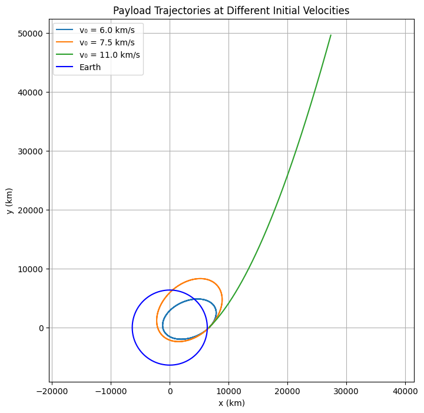
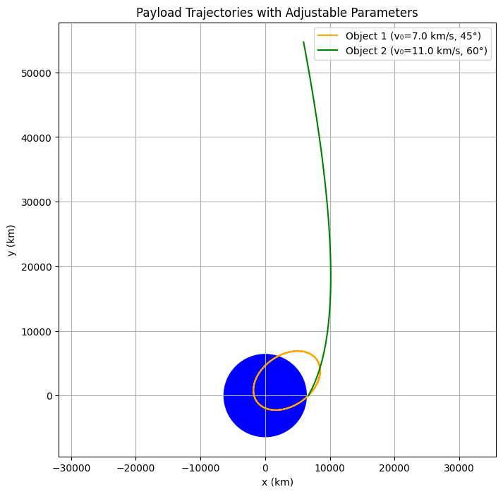

# Problem 3
##  Trajectories of a Freely Released Payload Near Earth

## **Motivation**
When a payload is released from a moving rocket near Earth, its resulting motion is governed by classical mechanics and gravitational forces. Depending on its speed and direction at the moment of release, the payload may fall back to Earth, enter orbit, escape Earth’s gravity, or follow a complex trajectory. This scenario blends concepts from Newtonian gravity and orbital mechanics, and is essential for space mission design and payload deployment.

---

## **1. Governing Physical Principles**

### **1.1 Newton's Law of Universal Gravitation**
The gravitational force acting on a payload of mass $m$ near Earth:

$$
F = \frac{GMm}{r^2}
$$

Where:
- $G$ is the gravitational constant: $6.67430 \times 10^{-11} \ \text{m}^3\,\text{kg}^{-1}\,\text{s}^{-2}$
- $M$ is the mass of the Earth ($5.972 \times 10^{24}\ \text{kg}$)
- $r$ is the distance from the center of the Earth to the payload

From Newton's Second Law $F = ma$, the gravitational acceleration is:

$$
a = \frac{F}{m} = \frac{GM}{r^2}
$$

This acceleration points toward the center of the Earth.

---

### **1.2 Total Mechanical Energy of the Payload**

The total energy $E$ of the payload determines the type of trajectory:

$$
E = K + U = \frac{1}{2}mv^2 - \frac{GMm}{r}
$$

Depending on $E$:
- $E < 0$: Elliptical orbit
- $E = 0$: Parabolic escape trajectory
- $E > 0$: Hyperbolic escape trajectory

---

$$
E = K + U = \frac{1}{2}mv^2 - \frac{GMm}{r}
$$

Depending on $E$:
- $E < 0$: Elliptical orbit
- $E = 0$: Parabolic escape trajectory
- $E > 0$: Hyperbolic escape trajectory

---

### **1.3 Orbital Velocity Conditions**
- **Circular Orbit (First Cosmic Velocity)**:
  $$v = \sqrt{\frac{GM}{r}}$$

- **Escape Velocity (Second Cosmic Velocity)**:
  $$v = \sqrt{\frac{2GM}{r}}$$

If the initial speed is between these two values, the object follows an **elliptical trajectory**.

---

## **2. Numerical Simulation Approach**

We simulate the payload’s trajectory using numerical integration of Newton’s equations of motion:

### **2.1 Equations of Motion (in 2D)**
Let the position be $\vec{r} = (x, y)$ and velocity $\vec{v} = (v_x, v_y)$.

Acceleration due to gravity is:
$$
\vec{a} = -\frac{GM}{r^3} \vec{r}
$$

Where $r = \sqrt{x^2 + y^2}$ and $\vec{r} = (x, y)$.

This gives a second-order ODE system:

$$
\frac{d^2x}{dt^2} = -\frac{GMx}{(x^2 + y^2)^{3/2}}, \quad \frac{d^2y}{dt^2} = -\frac{GMy}{(x^2 + y^2)^{3/2}}
$$

We convert this into a system of first-order ODEs for numerical integration.

---




```python
import numpy as np
import matplotlib.pyplot as plt
from scipy.integrate import solve_ivp

# Constants
G = 6.67430e-11  # gravitational constant (m^3 kg^-1 s^-2)
M = 5.972e24     # mass of Earth (kg)
R_earth = 6.371e6  # radius of Earth (m)

# Initial conditions
altitude = 300e3            # altitude above Earth's surface (m)
r0 = R_earth + altitude     # initial distance from Earth's center (m)
velocity_mag = 7500         # initial speed (m/s)
theta = np.radians(30)      # launch angle from horizontal (degrees to radians)

# Initial position and velocity components
x0 = r0
y0 = 0
vx0 = velocity_mag * np.cos(theta)
vy0 = velocity_mag * np.sin(theta)

# Time span for simulation
t_span = (0, 10000)  # seconds
t_eval = np.linspace(t_span[0], t_span[1], 10000)

# Define the system of ODEs
def equations(t, y):
    x, y_pos, vx, vy = y
    r = np.sqrt(x**2 + y_pos**2)
    ax = -G * M * x / r**3
    ay = -G * M * y_pos / r**3
    return [vx, vy, ax, ay]

# Initial state vector
y_init = [x0, y0, vx0, vy0]

# Solve the equations of motion
solution = solve_ivp(equations, t_span, y_init, t_eval=t_eval, rtol=1e-8)

# Extract solution
x_vals = solution.y[0]
y_vals = solution.y[1]
r_vals = np.sqrt(x_vals**2 + y_vals**2)

# Plot trajectory
plt.figure(figsize=(8, 8))
plt.plot(x_vals / 1e3, y_vals / 1e3, label='Payload Trajectory')

# Draw Earth
theta_circle = np.linspace(0, 2 * np.pi, 500)
plt.plot(R_earth * np.cos(theta_circle) / 1e3,
         R_earth * np.sin(theta_circle) / 1e3,
         color='blue', label='Earth')

plt.xlabel('x (km)')
plt.ylabel('y (km)')
plt.title('Trajectory of a Freely Released Payload')
plt.axis('equal')
plt.grid(True)
plt.legend()
plt.show()
```
## This Python code:
- Numerically solves the trajectory of an object released with a specific height, initial velocity, and angle,
- Under the influence of Earth's gravitational force (using Runge-Kutta with `solve_ivp`),
- Graphically plots the trajectory,
- Displays the shape of the Earth as a circle (for comparison).
---



```python
import numpy as np
import matplotlib.pyplot as plt
from scipy.integrate import solve_ivp

# Sabitler
G = 6.67430e-11     # Evrensel kütleçekim sabiti (m^3/kg/s^2)
M = 5.972e24        # Dünya'nın kütlesi (kg)
R = 6.371e6         # Dünya'nın yarıçapı (m)

# Başlangıç yüksekliği ve açısı
h = 300e3           # 300 km yukarıdan bırakılıyor
r0 = R + h
angle = np.radians(45)  # fırlatma açısı (dereceden radyana)

# Farklı hızlar (m/s cinsinden)
initial_speeds = [6000, 7500, 11000]

# Simülasyon süresi
t_span = (0, 10000)
t_eval = np.linspace(t_span[0], t_span[1], 10000)

# Diferansiyel denklem sistemi
def equations(t, y):
    x, y_pos, vx, vy = y
    r = np.sqrt(x**2 + y_pos**2)
    ax = -G * M * x / r**3
    ay = -G * M * y_pos / r**3
    return [vx, vy, ax, ay]

# Yörünge çizimi
plt.figure(figsize=(8, 8))
for v0 in initial_speeds:
    # Başlangıç vektörü
    vx0 = v0 * np.cos(angle)
    vy0 = v0 * np.sin(angle)
    y_init = [r0, 0, vx0, vy0]
    sol = solve_ivp(equations, t_span, y_init, t_eval=t_eval, rtol=1e-8)
    
    x_vals = sol.y[0] / 1e3  # km cinsine çevir
    y_vals = sol.y[1] / 1e3
    plt.plot(x_vals, y_vals, label=f'v₀ = {v0/1000:.1f} km/s')

# Dünya'nın çemberi
theta = np.linspace(0, 2*np.pi, 500)
plt.plot(R*np.cos(theta)/1e3, R*np.sin(theta)/1e3, color='blue', label='Earth')

# Grafik ayarları
plt.title('Payload Trajectories at Different Initial Velocities')
plt.xlabel('x (km)')
plt.ylabel('y (km)')
plt.axis('equal')
plt.grid(True)
plt.legend()
plt.show()
```

## 🛰️ Code Description – Payload Trajectories at Different Initial Velocities

This Python script simulates and visualizes the trajectories of a payload released from 300 km above Earth with different initial speeds:

## ✅ Key Features:
- Uses Newton’s law of gravitation to model motion in 2D space.
- Simulates trajectories for three different initial velocities: **6000 m/s**, **7500 m/s**, and **11000 m/s**.
- Integrates the equations of motion using `solve_ivp` (Runge-Kutta method).
- Plots each trajectory along with a circle representing Earth for comparison.

## 📊 Goal:

To show how initial velocity affects the type of trajectory:
- **Suborbital** (falls back to Earth),
- **Orbital** (remains in stable orbit),
- **Escape** (leaves Earth’s gravity).
---


```python
import numpy as np
import matplotlib.pyplot as plt
from scipy.integrate import solve_ivp
from ipywidgets import interact, FloatSlider, IntSlider
import matplotlib.patches as patches

# Constants
G = 6.67430e-11     # Gravitational constant (m^3 kg^-1 s^-2)
M = 5.972e24        # Mass of Earth (kg)
R = 6.371e6         # Radius of Earth (m)

# Equations of motion
def equations(t, y):
    x, y_pos, vx, vy = y
    r = np.sqrt(x**2 + y_pos**2)
    ax = -G * M * x / r**3
    ay = -G * M * y_pos / r**3
    return [vx, vy, ax, ay]

# Simulation function
def simulate_trajectories(h=300e3, v0_1=7000, angle_1=45, v0_2=11000, angle_2=60, sim_time=10000):
    fig, ax = plt.subplots(figsize=(8, 8))

    for v0, angle_deg, color, label in zip(
        [v0_1, v0_2],
        [angle_1, angle_2],
        ['orange', 'green'],
        ['Object 1', 'Object 2']
    ):
        r0 = R + h
        theta = np.radians(angle_deg)
        x0, y0 = r0, 0
        vx0 = v0 * np.cos(theta)
        vy0 = v0 * np.sin(theta)
        y_init = [x0, y0, vx0, vy0]

        t_span = (0, sim_time)
        t_eval = np.linspace(*t_span, 10000)
        sol = solve_ivp(equations, t_span, y_init, t_eval=t_eval, rtol=1e-8)

        x_vals = sol.y[0] / 1e3
        y_vals = sol.y[1] / 1e3
        ax.plot(x_vals, y_vals, label=f'{label} (v₀={v0/1000:.1f} km/s, {angle_deg}°)', color=color)

    # Draw filled Earth
    earth = patches.Circle((0, 0), R / 1e3, color='blue')
    ax.add_patch(earth)

    ax.set_title('Payload Trajectories with Adjustable Parameters')
    ax.set_xlabel('x (km)')
    ax.set_ylabel('y (km)')
    ax.axis('equal')
    ax.grid(True)
    ax.legend()
    plt.show()

# Interactive sliders
interact(
    simulate_trajectories,
    h=FloatSlider(min=100e3, max=1000e3, step=50e3, value=300e3, description='Altitude (m)'),
    v0_1=FloatSlider(min=5000, max=12000, step=500, value=7000, description='v₀₁ (m/s)'),
    angle_1=IntSlider(min=0, max=90, step=5, value=45, description='Angle₁ (°)'),
    v0_2=FloatSlider(min=5000, max=12000, step=500, value=11000, description='v₀₂ (m/s)'),
    angle_2=IntSlider(min=0, max=90, step=5, value=60, description='Angle₂ (°)'),
    sim_time=IntSlider(min=5000, max=20000, step=1000, value=10000, description='Time (s)')
);
```
link:[colab](https://colab.research.google.com/drive/1-UPL-tg1YPwzD20PgXzIWKdWti5VVhlK?usp=sharing)
 

 ## 🛰️ Code Explanation – Interactive Payload Trajectory Simulation

This Python code simulates the motion of two payloads released near Earth with different initial velocities and angles. It demonstrates how their trajectories evolve under Earth’s gravitational pull.

## ✅ Key Features
- Uses Newton’s law of gravity to compute motion in 2D space.
- Simulates and compares two different payloads.
- Lets you adjust:
  - **Altitude**: Initial height above Earth.
  - **Initial speeds and angles**: For both objects.
  - **Simulation time**: Duration of the simulation.
- Uses `ipywidgets` sliders to make the parameters interactive.
- Visualizes:
  - The curved paths (orbits/trajectories) of each payload.
  - A filled blue circle representing Earth.

## 📌 Goal
To show how changing the initial velocity and direction affects whether the payload:
- Falls back to Earth,
- Enters orbit,
- Escapes Earth’s gravity.
---

## **3. Initial Conditions**

Let’s assume the payload is released from a height $h$ above Earth’s surface with an initial velocity $v_0$ at angle $\theta$ from the horizontal.

- Initial position: $x_0 = R_{\oplus} + h$, $y_0 = 0$
- Initial velocity components:
  $$v_x = v_0 \cos(\theta)$$
  $$v_y = v_0 \sin(\theta)$$

---

## **4. Applications and Scenarios**

### **4.1 Orbital Insertion**
If $v_0 \approx \sqrt{\frac{GM}{R + h}}$, the payload can enter a circular or elliptical orbit.

### **4.2 Suborbital and Reentry**
If $v_0$ is low, the trajectory will be parabolic or elliptical, eventually leading to reentry.

### **4.3 Escape Trajectory**
If $v_0 \geq \sqrt{\frac{2GM}{R + h}}$, the payload escapes Earth’s gravity.

---

## **5. Deliverables**
- Python script that integrates the equations of motion for various initial conditions
- Visualizations of trajectories: reentry, orbital, and escape
- Energy calculations to classify the trajectory
- Analysis of velocity thresholds and angle dependence

---

 **Note:** The accompanying Python script uses the `solve_ivp` method from SciPy to integrate the motion equations, and Matplotlib to visualize the payload's path.

(See Python code for numerical simulation and trajectory plots.)


