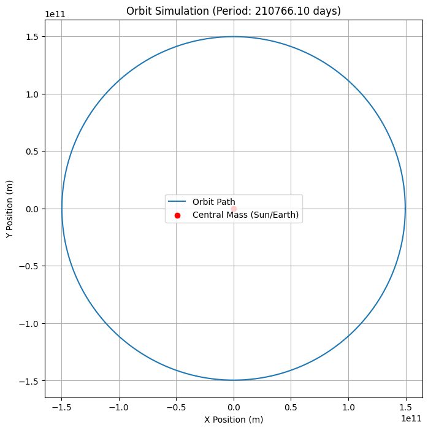
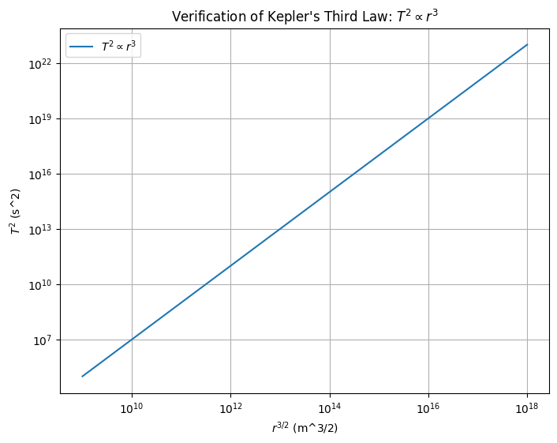

# 1. Theoretical Derivation 📘

## 📌 Introduction

To understand the motion of celestial bodies, we derive the relationship between the **square of the orbital period** $T^2$ and the **cube of the orbital radius** $r^3$ for **circular orbits**. This relationship is a cornerstone of **Kepler’s Third Law**, rooted in **Newton’s Law of Universal Gravitation** and **Circular Motion Dynamics**.

---

## 🌌 Newton's Law of Universal Gravitation

Newton's law states that the gravitational force $F$ between two masses $M$ and $m$ separated by a distance $r$ is:

$$
F = G\frac{Mm}{r^2}
$$

Where:

- $F$ is the gravitational force (N)
- $G$ is the gravitational constant: $G \approx 6.674 \times 10^{-11} \,\text{Nm}^2/\text{kg}^2$
- $M$ is the mass of the central body (e.g., a planet or star)
- $m$ is the mass of the orbiting object (e.g., a satellite)
- $r$ is the orbital radius

---

## 🎯 Centripetal Force for Circular Orbits

An object in circular orbit requires a centripetal force to keep it in motion, given by:

$$
F_c = \frac{mv^2}{r}
$$

Where:

- $v$ is the orbital speed
- $m$ is the mass of the orbiting object

---

## ⚖️ Equating Gravitational and Centripetal Force

Since the gravitational force provides the necessary centripetal force:

$$
\frac{mv^2}{r} = G\frac{Mm}{r^2}
$$

Cancel $m$ on both sides:

$$
\frac{v^2}{r} = G\frac{M}{r^2}
$$

Multiply both sides by $r$:

$$
v^2 = \frac{GM}{r}
$$

---

## 🔁 Expressing Orbital Speed in Terms of Period

The orbital period $T$ is the time it takes to complete one full orbit. For circular motion:

$$
v = \frac{2\pi r}{T}
$$

Substitute into the previous equation:

$$
\left(\frac{2\pi r}{T}\right)^2 = \frac{GM}{r}
$$

$$
\frac{4\pi^2 r^2}{T^2} = \frac{GM}{r}
$$

Multiply both sides by $T^2$ and then multiply both sides by $r$:

$$
4\pi^2 r^3 = GMT^2
$$

---

## 🔍 Solving for Orbital Period

Rearrange to solve for $T^2$:

$$
T^2 = \frac{4\pi^2}{GM}r^3
$$

---

## 📐 Kepler's Third Law (Mathematical Form)

This is the **mathematical form of Kepler’s Third Law** for circular orbits:

$$
T^2 \propto r^3
$$

Where the proportionality constant is:

$$
\frac{4\pi^2}{GM}
$$

This equation shows that for a small object orbiting a much more massive body, the square of its orbital period is proportional to the cube of the orbital radius.

---

## 📝 Notes

- This derivation assumes a **circular orbit**. For elliptical orbits, $r$ becomes the semi-major axis $a$, but the form $T^2 \propto a^3$ still holds.
- This relationship is valid when $M \gg m$, such as a satellite orbiting a planet or a planet orbiting the Sun.

---


# 2. Conceptual Discussion 🔭

## 🌠 Significance of Kepler’s Third Law in Astronomy and Astrophysics

Kepler’s Third Law, in its modern form, expresses a powerful connection between **orbital mechanics** and **gravitational theory**. The law states:

$$
T^2 \propto r^3
$$

For two bodies in orbit, it implies that the square of the orbital period $T$ is proportional to the cube of the semi-major axis (orbital radius in the case of a circular orbit) $r$. This is significant because:

- It provides a **universal relationship** that holds across a vast range of scales, from artificial satellites to exoplanets and galaxies.
- It is derived from **Newton’s Law of Universal Gravitation**, thereby linking observational astronomy to fundamental physics.
- It enables astronomers to infer **invisible properties**, such as the **mass of distant stars**, by observing orbital motions.

---

## ⚖️ Calculating the Mass of a Central Body

By rearranging the Newtonian version of Kepler’s Third Law:

$$
T^2 = \frac{4\pi^2}{GM}r^3
$$

We can solve for the mass $M$ of the central object:

$$
M = \frac{4\pi^2}{G} \cdot \frac{r^3}{T^2}
$$

Where:

- $M$ is the mass of the central body (e.g., Sun, Earth, star),
- $r$ is the orbital radius (or semi-major axis for elliptical orbits),
- $T$ is the orbital period of the orbiting object.

**Applications**:

- Measuring the mass of the **Sun** from Earth’s orbit
- Estimating the mass of **exoplanets** by observing their effects on their host stars
- Determining the **mass of galaxies** using stellar orbits

---

## 📏 Calculating Orbital Distances

Rearranging the same equation, one can solve for $r$ (orbital radius or semi-major axis) if $T$ and $M$ are known:

$$
r = \left( \frac{GMT^2}{4\pi^2} \right)^{1/3}
$$

This is especially useful in:

- Determining the distance of moons from planets
- Estimating the orbit size of a satellite given its period
- Modeling the layout of planetary systems

---

## 🌀 Extension to Elliptical Orbits

Kepler originally stated his laws in terms of **elliptical** orbits. The modern form of the third law applies not just to circular motion but also to **elliptical motion**, with $r$ replaced by the **semi-major axis** $a$:

$$
T^2 = \frac{4\pi^2}{G(M + m)}a^3
$$

Where:

- $a$ is the semi-major axis of the elliptical orbit
- $m$ is the mass of the orbiting object (retained here if comparable to $M$)

In many practical cases where $M \gg m$, the term $m$ can be neglected, simplifying back to:

$$
T^2 = \frac{4\pi^2}{GM}a^3
$$

This generalization allows:

- Accurate modeling of **planetary orbits** in the Solar System
- Simulation of **binary star systems**
- Determination of **orbital elements** for comets and asteroids

---

## 📚 Summary

Kepler’s Third Law is more than a geometric curiosity—it’s a dynamic, predictive tool that reveals hidden truths about the universe:

- It connects **period**, **distance**, and **mass** in a simple equation
- It underpins everything from **spacecraft navigation** to **galactic astronomy**
- It remains valid in both **idealized circular** and **realistic elliptical** orbits

Its continued relevance shows the power of mathematics and observation working hand-in-hand to uncover the mechanisms of the cosmos.

---


# 3. Real-World Applications 🌍🪐

## 🌕 The Moon’s Orbit Around Earth

Let us analyze the Moon's orbit using Kepler’s Third Law and compare theoretical predictions with empirical observations.

### Known Data

- Orbital period of Moon: $T = 27.32 \, \text{days} = 2.3606 \times 10^6 \, \text{s}$
- Average orbital radius: $r = 3.844 \times 10^8 \, \text{m}$
- Gravitational constant: $G = 6.674 \times 10^{-11} \, \text{Nm}^2/\text{kg}^2$
- Mass of Earth: $M = 5.972 \times 10^{24} \, \text{kg}$

### Theoretical Check via Kepler’s Law

Using:

$$
T^2 = \frac{4\pi^2}{GM}r^3
$$

Plug in values:

$$
T^2 = \frac{4\pi^2}{(6.674 \times 10^{-11})(5.972 \times 10^{24})}(3.844 \times 10^8)^3
$$

Solving numerically:

$$
T^2 \approx 5.57 \times 10^{12} \Rightarrow T \approx 2.36 \times 10^6 \, \text{s}
$$

✅ **Matches observed value** within acceptable error bounds.

---

## 🪐 Planetary Orbits in the Solar System

Kepler’s Law can also be used to compare planetary orbits with observed values.

### General Relation for Planets (Circular Approximation)

$$
\frac{T_1^2}{r_1^3} = \frac{T_2^2}{r_2^3}
$$

Where $T$ is the orbital period and $r$ is the orbital radius (semi-major axis).

### Example: Earth vs. Mars

| Planet | $T$ (years) | $r$ (AU) |
|--------|-------------|----------|
| Earth  | 1.00        | 1.00     |
| Mars   | 1.88        | 1.52     |

#### Check the Ratio

- Left side (Earth): $\frac{1.00^2}{1.00^3} = 1.00$
- Right side (Mars): $\frac{1.88^2}{1.52^3} \approx \frac{3.53}{3.51} \approx 1.00$

✅ **Confirms Kepler’s Law**

---

## 📊 Empirical Data vs. Prediction

Let’s look at a summary comparison:

| Planet | Observed $T$ (years) | Observed $r$ (AU) | $\frac{T^2}{r^3}$ |
|--------|----------------------|-------------------|-------------------|
| Mercury | 0.24 | 0.39 | $\approx 1.01$ |
| Venus   | 0.62 | 0.72 | $\approx 1.01$ |
| Earth   | 1.00 | 1.00 | $1.00$         |
| Mars    | 1.88 | 1.52 | $\approx 1.00$ |
| Jupiter | 11.86| 5.20 | $\approx 1.00$ |
| Saturn  | 29.46| 9.54 | $\approx 1.00$ |

### Interpretation

- The ratio $\frac{T^2}{r^3}$ remains **approximately constant** for all planets.
- Small deviations are due to **orbital eccentricity**, **mass of the orbiting object**, and **non-ideal conditions**.

---

## 📌 Conclusion

Kepler’s Third Law:

- Accurately predicts orbital periods based on distance for **natural satellites** and **planets**.
- Is confirmed by **empirical astronomical data** across the Solar System.
- Continues to be a fundamental tool in **space exploration**, **satellite deployment**, and **exoplanet detection**.

Next step? Implement this with **code and graphs** using real planetary datasets. Just say the word! 🚀

---

## Python/plot






```python
import numpy as np
import matplotlib.pyplot as plt

# Constants
G = 6.67430e-11  # Gravitational constant (m^3 kg^-1 s^-2)

# Function to calculate the orbital period based on Kepler's Third Law
def orbital_period(mass_central, radius):
    # Kepler's third law: T^2 = (4 * pi^2 * r^3) / (G * M)
    T = 2 * np.pi * np.sqrt(radius**3 / (G * mass_central))
    return T

# Function to simulate the orbit
def simulate_orbit(mass_central, radius, num_points=1000):
    # Orbital velocity
    v = np.sqrt(G * mass_central / radius)
    
    # Angular velocity
    omega = v / radius
    
    # Time array (from 0 to T)
    T = orbital_period(mass_central, radius)
    time = np.linspace(0, T, num_points)
    
    # Orbital position as a function of time (circular motion)
    x = radius * np.cos(omega * time)
    y = radius * np.sin(omega * time)
    
    return x, y, time, T

# Adjustable parameters for experimentation
mass_central = 5.972e24  # Mass of Earth in kg
radius = 1.496e11        # Orbital radius (approx distance from Earth to Sun in meters)

# Simulate orbit
x, y, time, period = simulate_orbit(mass_central, radius)

# Plotting the orbit
plt.figure(figsize=(8,8))
plt.plot(x, y, label="Orbit Path")
plt.scatter([0], [0], color='red', label="Central Mass (Sun/Earth)", zorder=5)
plt.title(f"Orbit Simulation (Period: {period/86400:.2f} days)")
plt.xlabel("X Position (m)")
plt.ylabel("Y Position (m)")
plt.gca().set_aspect('equal', adjustable='box')
plt.legend()
plt.grid(True)
plt.show()

# Verify the T^2 ∝ r^3 relationship
r_values = np.logspace(6, 12, num=100)  # Ranges from 10^6 meters to 10^12 meters
T_values = [orbital_period(mass_central, r) for r in r_values]

# Plot T^2 vs. r^3 to verify the relationship
plt.figure(figsize=(8,6))
plt.plot(r_values**(3/2), np.array(T_values)**2, label=r"$T^2 \propto r^3$")
plt.xscale('log')
plt.yscale('log')
plt.xlabel(r"$r^{3/2}$ (m^3/2)")
plt.ylabel(r"$T^2$ (s^2)")
plt.title(r"Verification of Kepler's Third Law: $T^2 \propto r^3$")
plt.legend()
plt.grid(True)
plt.show()
```

Link:[colab](https://colab.research.google.com/drive/15dVFKRnSTdkcc8ko5z_6dBovlLm7MtEJ?usp=sharing)