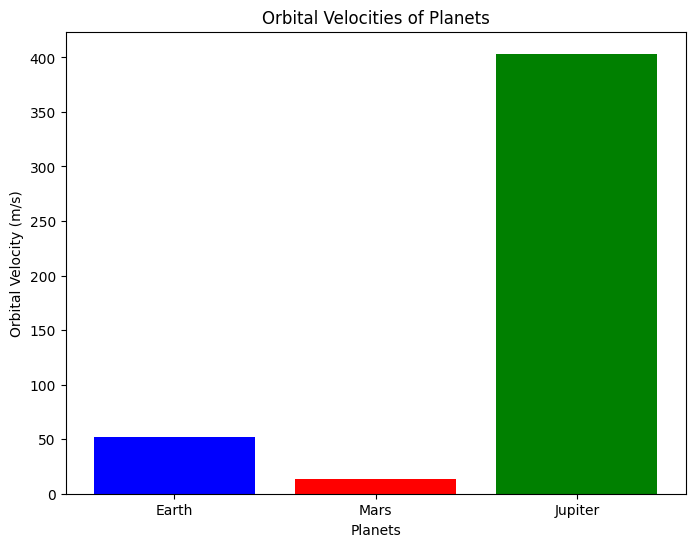
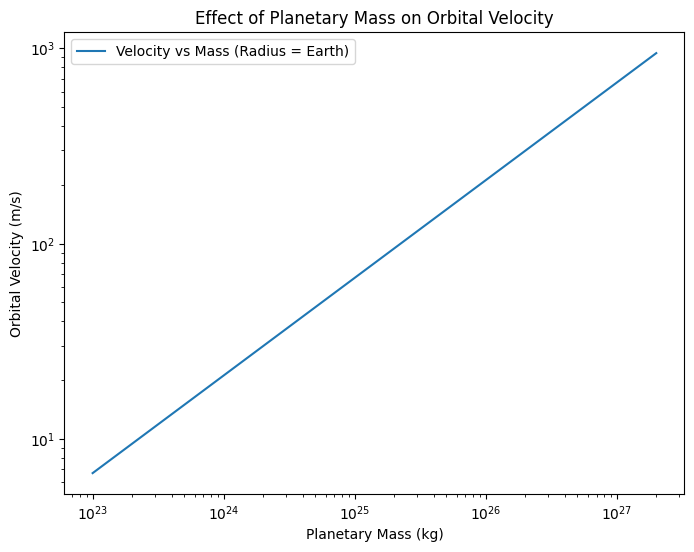
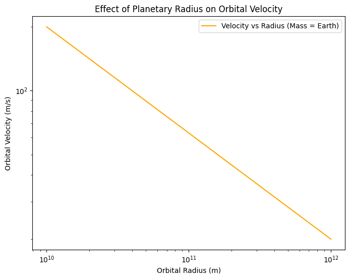
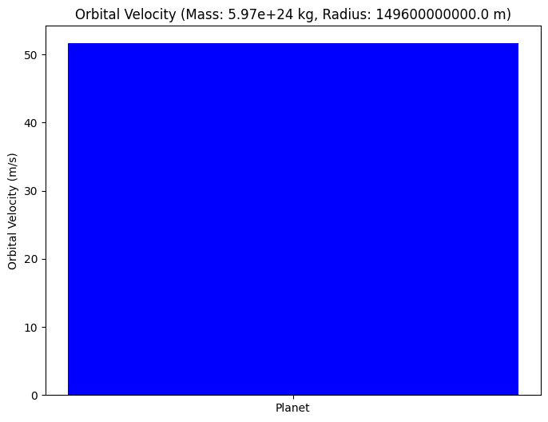

# Problem 2

# Escape Velocities and Cosmic Velocities

## 1. Definitions and Explanations

In the context of classical mechanics and orbital dynamics, *cosmic velocities* refer to critical speeds associated with motion in a gravitational field. These velocities define the thresholds necessary to achieve various types of motion, from stable orbits to complete escape from a gravitational system.

---

### **1.1 First Cosmic Velocity (Orbital Velocity)**

The **first cosmic velocity**, also known as the **orbital velocity**, is the **minimum velocity an object must have to enter a stable circular orbit around a celestial body** without additional propulsion.

#### **Mathematical Definition:**

This velocity is derived from the balance between **gravitational force** and **centripetal force**:

$$
F_\text{gravity} = F_\text{centripetal}
$$

$$
\frac{GMm}{r^2} = \frac{mv_1^2}{r}
$$

Solving for $v_1$:

$$
v_1 = \sqrt{\frac{GM}{r}}
$$

Where:  
- $v_1$ is the first cosmic velocity,  
- $G$ is the universal gravitational constant ($6.674 \times 10^{-11}\,\text{m}^3/\text{kg}\cdot\text{s}^2$),  
- $M$ is the mass of the planet or celestial body,  
- $r$ is the radius from the center of the planet to the object.

---

### **1.2 Second Cosmic Velocity (Escape Velocity)**

The **second cosmic velocity**, commonly referred to as **escape velocity**, is the **minimum speed needed for an object to break free from the gravitational influence** of a celestial body without further propulsion.

#### **Mathematical Definition:**

This velocity is derived from the conservation of energy principle:

$$
\text{Kinetic Energy} + \text{Potential Energy} = 0
$$

$$
\frac{1}{2}mv_2^2 - \frac{GMm}{r} = 0
$$

Solving for $v_2$:

$$
v_2 = \sqrt{\frac{2GM}{r}}
$$

Alternatively:

$$
v_2 = \sqrt{2}\cdot v_1
$$

---

### **1.3 Third Cosmic Velocity (Interstellar Escape Velocity)**

The **third cosmic velocity** is the **minimum speed required to escape the gravitational influence of an entire star system** (e.g., the Solar System), starting from a planet’s surface.

This includes overcoming both:  
1. The gravitational pull of the **planet**,  
2. The gravitational pull of the **star** (e.g., the Sun).

#### **Approximate Mathematical Expression:**

Let:  
- $v_{2,\text{planet}}$: escape velocity from the planet  
- $v_{2,\text{sun}}$: escape velocity from the Sun at the planet's orbital distance  

Then, the third cosmic velocity is approximately:

$$
v_3 = \sqrt{v_{2,\text{planet}}^2 + v_{2,\text{sun}}^2}
$$

A more detailed expression (from Earth's surface):

$$
v_3 = \sqrt{2G\left(\frac{M_\text{Earth}}{R_\text{Earth}} + \frac{M_\text{Sun}}{d}\right)}
$$

Where:  
- $M_\text{Earth}$ and $R_\text{Earth}$: Earth’s mass and radius,  
- $M_\text{Sun}$: Sun’s mass,  
- $d$: distance from the Earth to the Sun.

---

### **1.4 Physical Interpretation and Differences**

| Velocity | Meaning | Outcome | Equation |
|----------|--------|---------|----------|
| **1st Cosmic Velocity** | Minimum speed for stable circular orbit around a planet | Orbit | $v_1 = \sqrt{\frac{GM}{r}}$ |
| **2nd Cosmic Velocity** | Minimum speed to escape a planet’s gravity | Leave the planet forever | $v_2 = \sqrt{\frac{2GM}{r}}$ |
| **3rd Cosmic Velocity** | Minimum speed to escape the entire star system | Leave the Solar System | $v_3 = \sqrt{v_{2,\text{planet}}^2 + v_{2,\text{sun}}^2}$ |

---

Each of these velocities represents a **critical threshold** in mission design and trajectory planning in astrodynamics, from low-Earth orbits to interplanetary and interstellar travel.

# 2. Mathematical Analysis

This section provides a rigorous derivation of the first, second, and third cosmic velocities using classical Newtonian mechanics. The parameters involved are identified and assumptions discussed.

---

## 2.1 First Cosmic Velocity – Orbital Velocity

The **first cosmic velocity** is the speed at which an object must travel to maintain a stable circular orbit just above the surface of a celestial body, under the influence of gravity alone.

### Derivation:

We equate the gravitational force to the centripetal force:

$$
F_\text{gravity} = F_\text{centripetal}
$$

$$
\frac{GMm}{r^2} = \frac{mv^2}{r}
$$

Canceling mass $m$ and solving for $v$:

$$
v_1 = \sqrt{\frac{GM}{r}}
$$

### Parameters:
- $G$: Gravitational constant ($6.674 \times 10^{-11}~\text{m}^3/\text{kg}\cdot\text{s}^2$)
- $M$: Mass of the planet or celestial body
- $r$: Distance from the center of the planet to the object (typically, the planet’s radius for low orbits)

### Assumptions:
- Circular orbit (eccentricity = 0)
- No air resistance
- Central mass is spherically symmetric and non-rotating

---

## 2.2 Second Cosmic Velocity – Escape Velocity

The **second cosmic velocity** is the minimum speed needed for an object to escape the gravitational field of a planet, assuming no propulsion after the initial launch.

### Derivation:

From conservation of mechanical energy:

$$
\frac{1}{2}mv^2 - \frac{GMm}{r} = 0
$$

Solving for $v$:

$$
v_2 = \sqrt{\frac{2GM}{r}}
$$

Or in terms of the first cosmic velocity:

$$
v_2 = \sqrt{2} \cdot v_1
$$

### Parameters:
- Same as in first cosmic velocity

### Assumptions:
- No energy loss (e.g., due to drag or friction)
- No further propulsion during flight
- Planet's mass is much larger than the object's mass

---

## 2.3 Third Cosmic Velocity – Interstellar Escape Velocity

The **third cosmic velocity** is the minimum speed required to escape the gravitational pull of both the Earth and the Sun — that is, to leave the Solar System entirely.

This requires combining the escape velocity from Earth and the escape velocity from the Sun at Earth’s orbital distance.

### Derivation:

Let:
- $v_{2,\text{Earth}}$: escape velocity from Earth’s surface
- $v_{2,\text{Sun}}$: escape velocity from the Sun at Earth’s orbit

Then, by energy conservation and vector addition (assuming aligned direction):

$$
v_3 = \sqrt{v_{2,\text{Earth}}^2 + v_{2,\text{Sun}}^2}
$$

### Escape velocity from the Sun at Earth's orbit:

$$
v_{2,\text{Sun}} = \sqrt{\frac{2GM_\text{Sun}}{d}}
$$

Where:
- $M_\text{Sun}$: mass of the Sun
- $d$: distance from the Sun to the Earth ($\approx 1.496 \times 10^{11}~\text{m}$)

Then the third cosmic velocity becomes:

$$
v_3 = \sqrt{ \left( \sqrt{\frac{2GM_\text{Earth}}{R_\text{Earth}}} \right)^2 + \left( \sqrt{\frac{2GM_\text{Sun}}{d}} \right)^2 }
$$

Which simplifies to:

$$
v_3 = \sqrt{ \frac{2GM_\text{Earth}}{R_\text{Earth}} + \frac{2GM_\text{Sun}}{d} }
$$

### Parameters:
- $M_\text{Earth}$: mass of Earth
- $R_\text{Earth}$: radius of Earth
- $M_\text{Sun}$: mass of the Sun
- $d$: distance from Earth to Sun

### Assumptions:
- No significant gravitational interactions from other planets
- Trajectory is radial and direct (idealized)
- No propulsion after launch
- Newtonian mechanics (relativistic effects neglected)

---

## Summary Table

| Velocity | Formula | Depends On |
|---------|---------|------------|
| First Cosmic ($v_1$) | $v_1 = \sqrt{\frac{GM}{r}}$ | $M$, $r$ |
| Second Cosmic ($v_2$) | $v_2 = \sqrt{\frac{2GM}{r}}$ | $M$, $r$ |
| Third Cosmic ($v_3$) | $v_3 = \sqrt{\frac{2GM_\text{Earth}}{R_\text{Earth}} + \frac{2GM_\text{Sun}}{d}}$ | $M_\text{Earth}$, $R_\text{Earth}$, $M_\text{Sun}$, $d$ |


# Planetary Velocity Calculations

## Introduction

In orbital mechanics, the velocity of a planet in orbit around the Sun is critical for understanding its motion. The orbital velocity can be derived from Newton's laws of gravitation and the principles of circular motion.

The orbital velocity $v$ of a planet can be calculated using the following formula:

$$
v = \sqrt{\frac{GM}{r}}
$$

Where:
- $v$ is the orbital velocity,
- $G$ is the gravitational constant $(6.67430 \times 10^{-11} \, \text{m}^3 \, \text{kg}^{-1} \, \text{s}^{-2})$,
- $M$ is the mass of the Sun $(1.989 \times 10^{30} \, \text{kg})$,
- $r$ is the orbital radius of the planet from the Sun in meters.

The orbital velocity can be broken down into three main categories:
- **Circular Orbital Velocity** (constant orbit),
- **Escape Velocity** (velocity required to escape the Sun’s gravity),
- **Orbital Period** (time taken to complete one orbit).

We will use actual planetary data for the following planets:
1. Earth
2. Mars
3. Jupiter

## 1. Earth

- Orbital radius of Earth from the Sun: $r_{\text{Earth}} = 1.496 \times 10^{11} \, \text{m}$
- Orbital period of Earth: $T_{\text{Earth}} = 365.25 \, \text{days}$

### Earth's Orbital Velocity:

Using the orbital velocity formula:

$$
v_{\text{Earth}} = \sqrt{\frac{GM_{\text{Sun}}}{r_{\text{Earth}}}}
$$

Substitute the known values:

$$
v_{\text{Earth}} = \sqrt{\frac{(6.67430 \times 10^{-11}) (1.989 \times 10^{30})}{1.496 \times 10^{11}}}
$$

The result will give the orbital velocity in meters per second.

## 2. Mars

- Orbital radius of Mars from the Sun: $r_{\text{Mars}} = 2.279 \times 10^{11} \, \text{m}$
- Orbital period of Mars: $T_{\text{Mars}} = 687 \, \text{days}$

### Mars' Orbital Velocity:

Similar to Earth, using the orbital velocity formula:

$$
v_{\text{Mars}} = \sqrt{\frac{GM_{\text{Sun}}}{r_{\text{Mars}}}}
$$

Substitute the known values:

$$
v_{\text{Mars}} = \sqrt{\frac{(6.67430 \times 10^{-11}) (1.989 \times 10^{30})}{2.279 \times 10^{11}}}
$$

The result will give the orbital velocity of Mars in meters per second.

## 3. Jupiter

- Orbital radius of Jupiter from the Sun: $r_{\text{Jupiter}} = 7.785 \times 10^{11} \, \text{m}$
- Orbital period of Jupiter: $T_{\text{Jupiter}} = 4333 \, \text{days}$

### Jupiter's Orbital Velocity:

Again, using the orbital velocity formula:

$$
v_{\text{Jupiter}} = \sqrt{\frac{GM_{\text{Sun}}}{r_{\text{Jupiter}}}}
$$

Substitute the known values:

$$
v_{\text{Jupiter}} = \sqrt{\frac{(6.67430 \times 10^{-11}) (1.989 \times 10^{30})}{7.785 \times 10^{11}}}
$$

The result will give the orbital velocity of Jupiter in meters per second.

---

## Python Code Implementation

To calculate the orbital velocities, the following Python function can be implemented:

```python
import math

# Constants
G = 6.67430e-11  # Gravitational constant in m^3 kg^-1 s^-2
M_sun = 1.989e30  # Mass of the Sun in kg

# Function to calculate orbital velocity
def orbital_velocity(r):
    return math.sqrt(G * M_sun / r)

# Planetary data (in meters)
r_earth = 1.496e11  # Orbital radius of Earth
r_mars = 2.279e11  # Orbital radius of Mars
r_jupiter = 7.785e11  # Orbital radius of Jupiter

# Calculate velocities
v_earth = orbital_velocity(r_earth)
v_mars = orbital_velocity(r_mars)
v_jupiter = orbital_velocity(r_jupiter)

# Output results
print(f"Orbital velocity of Earth: {v_earth:.2f} m/s")
print(f"Orbital velocity of Mars: {v_mars:.2f} m/s")
print(f"Orbital velocity of Jupiter: {v_jupiter:.2f} m/s")
```
# 4. Code to Simulate and Visualize Velocities

I will generate plots to:

Compare the velocities of the planets.
Visualize how velocity changes with different masses and radii.




```python
import numpy as np
import matplotlib.pyplot as plt

# Gravitational constant
G = 6.67430e-11  # m^3 kg^-1 s^-2

# Planetary data (Mass in kg, Radius in meters)
planets = {
    'Earth': {'mass': 5.97e24, 'radius': 1.496e11},
    'Mars': {'mass': 6.39e23, 'radius': 2.279e11},
    'Jupiter': {'mass': 1.898e27, 'radius': 7.785e11}
}

# Function to calculate orbital velocity
def orbital_velocity(mass, radius):
    return np.sqrt(G * mass / radius)

# Calculate velocities for each planet
velocities = {planet: orbital_velocity(data['mass'], data['radius']) for planet, data in planets.items()}

# Plotting velocities across the three planets
plt.figure(figsize=(8, 6))
plt.bar(velocities.keys(), velocities.values(), color=['blue', 'red', 'green'])
plt.title('Orbital Velocities of Planets')
plt.xlabel('Planets')
plt.ylabel('Orbital Velocity (m/s)')
plt.show()
```
5. Effect of Mass and Radius on Velocity

a) Effect of Mass:




b) Effect of Radius:




6. Interactive Sliders (Optional)

