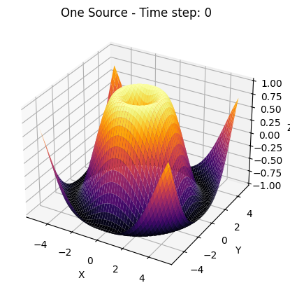
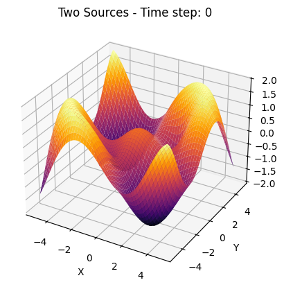
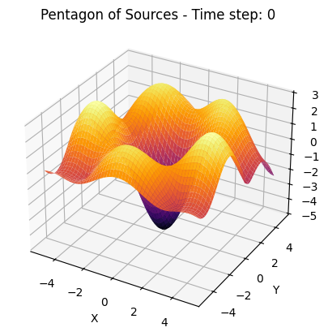

# Problem 1
# Interference Patterns on a Water Surface

## 1. Motivation

Interference occurs when multiple wave sources overlap in space and time, forming a new resultant wave pattern. On a water surface, this is observable as ripple patterns that vary in intensity depending on the positions and phases of the sources. This forms the basis of **constructive interference** (wave amplification) and **destructive interference** (wave cancellation).

Studying wave interference helps us understand key physics concepts like **superposition**, **phase relationships**, and **wave propagation** — relevant in fields ranging from acoustics and optics to quantum physics and antenna design.

## 2. Mathematical Foundations

### 2.1 Circular Wave from a Point Source

A point source located at $(x_0,y_0)$ emits a circular wave that propagates outward. The displacement $\eta(x,y,t)$ of the water surface at a point $(x,y)$ and time $t$ is given by:

$$
\eta(x,y,t) = \frac{A}{\sqrt{r}} \cos(kr - \omega t + \phi)
$$
Where:

- $A$: amplitude of the wave  
- $r = \sqrt{(x - x_0)^2 + (y - y_0)^2}$: distance from the source to the point  
- $k = \frac{2\pi}{\lambda}$: wave number  
- $\lambda$: wavelength  
- $\omega = 2\pi f$: angular frequency  
- $f$: frequency  
- $\phi$: initial phase of the wave  



```python
import numpy as np
import matplotlib.pyplot as plt

# Izgara oluştur
x = np.linspace(-50, 50, 500)
y = np.linspace(-50, 50, 500)
X, Y = np.meshgrid(x, y)

# Noktasal kaynaktan uzaklık (r)
r = np.sqrt(X**2 + Y**2)

# Dalga fonksiyonu
wave = np.sin(r)

# Grafik çizimi
plt.figure(figsize=(6, 6))
plt.imshow(wave, extent=[-50, 50, -50, 50], origin='lower', cmap='viridis')
plt.colorbar(label='Amplitude')
plt.title('Single Circular Wave from a Point Source')
plt.xlabel('x')
plt.ylabel('y')
plt.show()

 ```
### 2.2 Superposition of Multiple Waves

When there are $N$ point sources, each emitting coherent waves, the total displacement at a point $(x,y)$ is the **sum** of the displacements from each source:

$$
\eta_{\text{sum}}(x,y,t) = \sum_{i=1}^{N} \frac{A}{\sqrt{r_i}} \cos(kr_i - \omega t + \phi_i)
$$

Where each $r_i = \sqrt{(x - x_i)^2 + (y - y_i)^2}$ is the distance from the $i$-th source located at $(x_i, y_i)$, and $\phi_i$ is the initial phase of that source.

### 2.3 Source Geometry: Regular Polygon Configuration

To ensure symmetry and regular interference patterns, sources are placed at the vertices of a regular polygon with radius $R$ centered at the origin. The coordinates of the $i$-th source (for $N$ total sources) are:

$$
(x_i, y_i) = \left(R \cos\left(\frac{2\pi i}{N}\right), R \sin\left(\frac{2\pi i}{N}\right)\right), \quad i = 0, 1, \dots, N-1
$$

This configuration leads to symmetric and often beautiful interference patterns, especially when $N = 3$ (triangle), $N = 4$ (square), $N = 5$ (pentagon), etc.

## 3. Interference Analysis

### 3.1 Constructive Interference

Occurs when wave crests meet crests and troughs meet troughs, leading to amplification:

$$
\Delta\phi = 2\pi n, \quad n \in \mathbb{Z}
$$

### 3.2 Destructive Interference
### 3.1 Constructive Interference

Occurs when wave crests meet crests and troughs meet troughs, leading to amplification:

$$
\Delta\phi = 2\pi n, \quad n \in \mathbb{Z}
$$

### 3.2 Destructive Interference

Occurs when wave crests meet troughs, leading to cancellation:

$$
\Delta\phi = (2n + 1)\pi, \quad n \in \mathbb{Z}
$$

These conditions are crucial in analyzing the positions of **nodal lines** (destructive zones) and **antinodal lines** 
(constructive zones).

---
# Moiré Wave Interference Visualization with interactive sliders


```python
import numpy as np
import matplotlib.pyplot as plt
from ipywidgets import interact, FloatSlider

# Grid
x = np.linspace(-10, 10, 600)
y = np.linspace(-10, 10, 600)
X, Y = np.meshgrid(x, y)

def moire_wave(theta1=0, theta2=30, k1=1.0, k2=1.05, phase=0.0):
    # Dalga yönlerini radyana çevir
    t1 = np.radians(theta1)
    t2 = np.radians(theta2)
    
    # İki düzlem dalgası tanımla
    wave1 = np.cos(k1 * (X * np.cos(t1) + Y * np.sin(t1)))
    wave2 = np.cos(k2 * (X * np.cos(t2) + Y * np.sin(t2)) + phase)
    
    # Üst üste bindirme (interference)
    result = wave1 + wave2

    # Görselleştir
    plt.figure(figsize=(8, 8))
    plt.imshow(result, extent=[-10, 10, -10, 10], cmap='inferno', origin='lower')
    plt.title('Moiré Interference Pattern')
    plt.axis('off')
    plt.tight_layout()
    plt.show()
# Etkileşimli arayüz
interact(
    moire_wave,
    theta1=FloatSlider(min=0, max=180, step=1, value=0, description='Angle 1 (°)'),
    theta2=FloatSlider(min=0, max=180, step=1, value=30, description='Angle 2 (°)'),
    k1=FloatSlider(min=0.5, max=2.0, step=0.01, value=1.0, description='k1'),
    k2=FloatSlider(min=0.5, max=2.0, step=0.01, value=1.05, description='k2'),
    phase=FloatSlider(min=0.0, max=2*np.pi, step=0.1, value=0.0, description='Phase Δφ'),
)
```
# Moiré Wave Interference Visualization
This Python code creates an interactive 2D visualization of moiré interference patterns formed by the superposition of two plane waves.


## What it does:
	•	Simulates two waves traveling at different angles and wave numbers (k1, k2).
	•	The result of their interference is displayed as a moiré pattern — a visually striking pattern that looks 3D or holographic.
	•	Uses sliders (ipywidgets) to control:
	•	Angles of each wave
	•	Wave numbers (spatial frequency)
	•	Phase offset

⸻

## Purpose:

To explore how small differences in wave direction and frequency create complex interference patterns — useful in optics, physics, and signal processing.

---

## 4. Parameters and Their Effects
| Parameter         | Symbol     | Effect on Pattern                                           |
|------------------|------------|-------------------------------------------------------------|
| Amplitude        | $A$        | Affects brightness/intensity of plot, not pattern shape     |
| Wavelength       | $\lambda$  | Larger $\lambda$ → wider fringes                            |
| Frequency        | $f$        | Affects speed of time-dependent animation, not pattern shape|
| Phase Offset     | $\phi$     | Can shift/interfere patterns asymmetrically                 |
| Number of Sources| $N$        | More sources = richer, more complex patterns                |
| Polygon Radius   | $R$        | Affects spacing and detail in the pattern                   |
---
#  interference patterns on a water surface

## 🎯 objective

Analyze the interference patterns formed on the water surface due to the superposition of waves emitted from point sources placed at the vertices of a chosen regular polygon.

---

##  steps to follow

### 1. select a regular polygon

We choose a **regular polygon** — for example:
- equilateral triangle
- square
- regular pentagon

Let the polygon have $N$ vertices (and hence $N$ point sources), placed symmetrically around a circle of radius $R$ centered at the origin.

Each vertex (source position) is given by:
$$
\vec{r}_i = \left(R \cos\left(\theta_i\right), R \sin\left(\theta_i\right)\right), \quad \theta_i = \frac{2\pi(i-1)}{N}, \quad i = 1, 2, \dots, N
$$

---

### 2. position the sources

We place point wave sources at these $N$ vertices. All sources emit **coherent circular waves** with:

- same amplitude $A$
- same wavelength $\lambda$
- same frequency $f$
- same initial phase $\phi = 0$
---

### 3. wave equations

The wave emitted from the $i$-th source located at $\vec{r}_i$ is described by:

$$
\eta_i(x, y, t) = A \cdot \cos\left(k \cdot |\vec{r} - \vec{r}_i| - \omega t \right)
$$

Where:
- $\vec{r} = (x, y)$ is the observation point on the water surface
- $k = \dfrac{2\pi}{\lambda}$ is the wave number
- $\omega = 2\pi f$ is the angular frequency
- $|\vec{r} - \vec{r}_i|$ is the Euclidean distance between the observation point and source $i$

---
### 4. superposition of waves

By the principle of superposition, the total displacement at point $(x, y)$ and time $t$ is:

$$
\eta_{\text{sum}}(x, y, t) = \sum_{i=1}^{N} \eta_i(x, y, t) = \sum_{i=1}^{N} A \cdot \cos\left(k \cdot |\vec{r} - \vec{r}_i| - \omega t \right)
$$

This total wave function governs the interference pattern on the water surface.

---

## Analyze interference patterns

We analyze $\eta_{\text{sum}}(x, y, t)$ to find:

- **constructive interference**:  
  When waves arrive **in phase**, amplifying displacement.  

- **destructive interference**:  
  When waves arrive **out of phase**, leading to cancellation.

These patterns depend on the **differences in distance** from each point to the sources, and hence on the geometry of the polygon.

---

```python
import numpy as np
import matplotlib.pyplot as plt

# Wave parameters
A = 1.0               # Amplitude
wavelength = 1.0      # Wavelength (lambda)
k = 2 * np.pi / wavelength  # Wave number
f = 1.0               # Frequency
omega = 2 * np.pi * f # Angular frequency
phi = 0               # Phase

# Grid setup
x_range = y_range = 5.0
resolution = 500
x = np.linspace(-x_range, x_range, resolution)
y = np.linspace(-y_range, y_range, resolution)
X, Y = np.meshgrid(x, y)

# Time snapshot (can loop later for animation)
t = 0

# Polygon setup
N = 5          # Number of sources (e.g., 3 for triangle, 4 for square, 5 for pentagon)
R = 2.0        # Radius of polygon

# Source positions
angles = np.linspace(0, 2 * np.pi, N, endpoint=False)
sources = [(R * np.cos(a), R * np.sin(a)) for a in angles]

# Compute total wave field
eta_sum = np.zeros_like(X)

for (x0, y0) in sources:
    r = np.sqrt((X - x0)**2 + (Y - y0)**2)
    eta_i = A / np.sqrt(r + 1e-6) * np.cos(k * r - omega * t + phi)
    eta_sum += eta_i

# Plotting
plt.figure(figsize=(8, 6))
plt.pcolormesh(X, Y, eta_sum, shading='auto', cmap='RdBu')
plt.colorbar(label='Wave Displacement')
plt.title(f'Interference Pattern from {N} Coherent Sources (Polygon)')
plt.xlabel('x')
plt.ylabel('y')
plt.gca().set_aspect('equal')
plt.grid(False)
plt.tight_layout()
plt.show()
```
# Wave Interference Simulation

This code visualizes the interference pattern created by multiple circular wave sources arranged in a regular polygon.

⸻

## 🔧 What It Does

	•	Places N wave sources on a circle (polygon).
	•	Each source emits a circular wave.
	•	Uses the superposition principle to compute total wave displacement on a 2D grid.
	•	Plots the result as a color map showing constructive and destructive interference.

⸻

## 🧪 Key Parameters
	•	A: Amplitude
	•	λ: Wavelength
	•	f: Frequency
	•	N: Number of sources (e.g. 3 = triangle, 5 = pentagon)
	•	R: Radius of the polygon
	•	t: Time snapshot (static)

⸻

## 📊 Output
	•	A 2D plot of the wave interference pattern
	•	Shows how waves from multiple sources interact over space.
---

# Interactive Wave Interference Simulation with Animation (with sliders)

