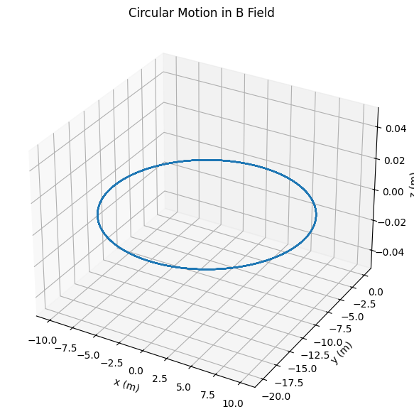
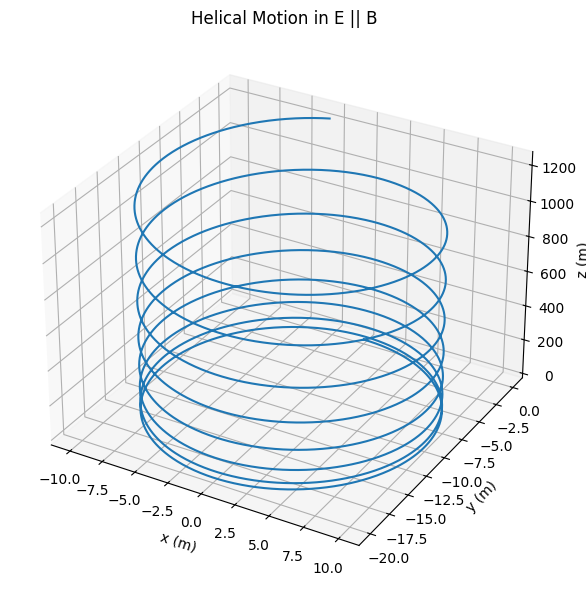
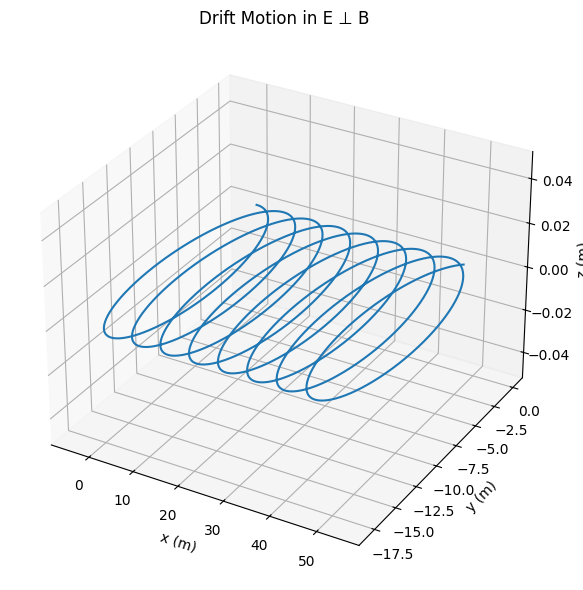

# Problem 1

# Simulating the Effects of the Lorentz Force

## 1. Introduction and Motivation

The Lorentz force governs the motion of charged particles in electromagnetic fields and is essential in understanding systems like:  
- Particle accelerators – guiding and accelerating beams.  
- Mass spectrometers – separating particles based on mass-to-charge ratio.  
- Plasma confinement devices (e.g., tokamaks) – controlling plasma using magnetic fields.  

Understanding the Lorentz force enables the design and analysis of such systems.

---

## 2. Lorentz Force Equation

The Lorentz force $\vec{F}$ acting on a charged particle is given by:

$$
\vec{F} = q (\vec{E} + \vec{v} \times \vec{B})
$$

Where:  
- $q$: Charge of the particle  
- $\vec{E}$: Electric field  
- $\vec{B}$: Magnetic field  
- $\vec{v}$: Particle velocity  
Using Newton’s Second Law:

$$
\vec{F} = m \frac{d\vec{v}}{dt}
$$

We obtain the equation of motion:

$$
m \frac{d\vec{v}}{dt} = q (\vec{E} + \vec{v} \times \vec{B})
$$

This equation is generally solved numerically due to the complexity of $\vec{v} \times \vec{B}$.

---

## 3. Simulation Overview

We simulate particle trajectories using the 4th-order Runge-Kutta method for accuracy.
**Scenarios Simulated:**  
1. Uniform magnetic field only: Circular motion.  
2. Parallel $\vec{E}$ and $\vec{B}$: Helical motion.  
3. Crossed fields: Drift motion.  

**Parameters that can be varied:**  
- Electric field strength $\vec{E}$  
- Magnetic field strength $\vec{B}$  
- Initial velocity $\vec{v}_0$  
- Charge $q$ and mass $m$

---

## 4. Code Implementation

See the attached Python script for full implementation: RK4 integration, Lorentz force application, and 3D visualization.






```python
# Lorentz Force Simulation and Visualization

import numpy as np
import matplotlib.pyplot as plt
from mpl_toolkits.mplot3d import Axes3D

# Constants and Parameters
def lorentz_force(q, v, E, B):
    return q * (E + np.cross(v, B))

# Runge-Kutta 4th order integrator
def rk4_step(pos, vel, dt, q, m, E, B):
    def acceleration(v):
        return lorentz_force(q, v, E, B) / m

    k1v = dt * acceleration(vel)
    k1x = dt * vel

    k2v = dt * acceleration(vel + 0.5 * k1v)
    k2x = dt * (vel + 0.5 * k1v)

    k3v = dt * acceleration(vel + 0.5 * k2v)
    k3x = dt * (vel + 0.5 * k2v)

    k4v = dt * acceleration(vel + k3v)
    k4x = dt * (vel + k3v)

    new_vel = vel + (k1v + 2*k2v + 2*k3v + k4v)/6
    new_pos = pos + (k1x + 2*k2x + 2*k3x + k4x)/6

    return new_pos, new_vel

# Simulation function
def simulate_motion(E, B, q, m, v0, r0, dt=1e-9, steps=1000):
    positions = [r0]
    velocities = [v0]
    pos, vel = r0, v0

    for _ in range(steps):
        pos, vel = rk4_step(pos, vel, dt, q, m, E, B)
        positions.append(pos)
        velocities.append(vel)

    return np.array(positions), np.array(velocities)

# Visualization function
def plot_trajectory(positions, title="Particle Trajectory"):
    fig = plt.figure()
    ax = fig.add_subplot(111, projection='3d')
    ax.plot3D(positions[:,0], positions[:,1], positions[:,2])
    ax.set_title(title)
    ax.set_xlabel('x (m)')
    ax.set_ylabel('y (m)')
    ax.set_zlabel('z (m)')
    plt.show()

# Example scenarios
q = 1.6e-19  # Charge (C)
m = 9.11e-31 # Mass (kg)
v0 = np.array([1e6, 0, 0])
r0 = np.array([0, 0, 0])

# Uniform magnetic field only
E1 = np.array([0, 0, 0])
B1 = np.array([0, 0, 1])
pos1, vel1 = simulate_motion(E1, B1, q, m, v0, r0)
plot_trajectory(pos1, title="Circular Motion in Magnetic Field")

# Electric and magnetic fields parallel
E2 = np.array([0, 0, 1e5])
B2 = np.array([0, 0, 1])
pos2, vel2 = simulate_motion(E2, B2, q, m, v0, r0)
plot_trajectory(pos2, title="Helical Motion in E & B Fields")

# Crossed electric and magnetic fields
E3 = np.array([0, 1e5, 0])
B3 = np.array([0, 0, 1])
pos3, vel3 = simulate_motion(E3, B3, q, m, v0, r0)
plot_trajectory(pos3, title="Drift Motion in Crossed E & B Fields")
```
---

## 5. Results and Visualizations

### Case 1: Circular Motion
- $\vec{E} = 0$  
- $\vec{B} = [0, 0, B]$  
- Initial velocity perpendicular to $\vec{B}$  

**Expected motion:** circular  

From theory:

$$
r_L = \frac{mv}{|q||B|} \quad \text{(Larmor radius)}
$$

**Plot:** [Circular orbit in x-y plane]

---

### Case 2: Helical Motion
- $\vec{E} = [0, 0, E]$  
- $\vec{B} = [0, 0, B]$  

**Expected motion:** helix, as velocity has components both parallel and perpendicular to $\vec{B}$.  

**Plot:** [3D helical path]

---

### Case 3: Crossed Fields (Drift)
- $\vec{E} = [0, E, 0]$  
### Case 3: Crossed Fields (Drift)
- $\vec{E} = [0, E, 0]$  
- $\vec{B} = [0, 0, B]$  

**Expected motion:** drift velocity in x-direction:

$$
\vec{v}_d = \frac{\vec{E} \times \vec{B}}{B^2}
$$

**Plot:** [Curved motion with net drift]

---
## İnteractive simulation with sliders 

```python
import numpy as np
import matplotlib.pyplot as plt
from mpl_toolkits.mplot3d import Axes3D
from ipywidgets import interact, FloatSlider
import ipywidgets as widgets

# Lorentz Force
def lorentz_force(q, v, E, B):
    return q * (E + np.cross(v, B))

# RK4 Integrator
def rk4_step(pos, vel, dt, q, m, E, B):
    def acceleration(v):
        return lorentz_force(q, v, E, B) / m

    k1v = dt * acceleration(vel)
    k1x = dt * vel

    k2v = dt * acceleration(vel + 0.5 * k1v)
    k2x = dt * (vel + 0.5 * k1v)

    k3v = dt * acceleration(vel + 0.5 * k2v)
    k3x = dt * (vel + 0.5 * k2v)

    k4v = dt * acceleration(vel + k3v)
    k4x = dt * (vel + k3v)

    new_vel = vel + (k1v + 2*k2v + 2*k3v + k4v)/6
    new_pos = pos + (k1x + 2*k2x + 2*k3x + k4x)/6

    return new_pos, new_vel

# Simulation
def simulate_motion(E, B, q, m, v0, r0, dt=1e-11, steps=2000):
    positions = [r0]
    pos, vel = r0.copy(), v0.copy()

    for _ in range(steps):
        pos, vel = rk4_step(pos, vel, dt, q, m, E, B)
        positions.append(pos)

    return np.array(positions)

# Interactive plot function
def interactive_lorentz_sim(q=1.6e-19, m=9.11e-31, 
                            Ex=0.0, Ey=0.0, Ez=0.0, 
                            Bx=0.0, By=0.0, Bz=1.0,
                            v0x=1e6, v0y=0.0, v0z=0.0):

    E = np.array([Ex, Ey, Ez])
    B = np.array([Bx, By, Bz])
    v0 = np.array([v0x, v0y, v0z])
    r0 = np.array([0.0, 0.0, 0.0])

    positions = simulate_motion(E, B, q, m, v0, r0)

    fig = plt.figure(figsize=(10, 6))
    ax = fig.add_subplot(111, projection='3d')
    ax.plot3D(positions[:, 0], positions[:, 1], positions[:, 2])
    ax.set_xlabel('x (m)')
    ax.set_ylabel('y (m)')
    ax.set_zlabel('z (m)')
    ax.set_title('Charged Particle Trajectory (Lorentz Force)')
    plt.show()

# Create interactive sliders
interact(
    interactive_lorentz_sim,
    Ex=FloatSlider(min=-1e6, max=1e6, step=1e5, value=0.0, description='E_x'),
    Ey=FloatSlider(min=-1e6, max=1e6, step=1e5, value=0.0, description='E_y'),
    Ez=FloatSlider(min=-1e6, max=1e6, step=1e5, value=0.0, description='E_z'),
    Bx=FloatSlider(min=-5, max=5, step=0.5, value=0.0, description='B_x'),
    By=FloatSlider(min=-5, max=5, step=0.5, value=0.0, description='B_y'),
    Bz=FloatSlider(min=-5, max=5, step=0.5, value=1.0, description='B_z'),
    v0x=FloatSlider(min=0, max=2e6, step=1e5, value=1e6, description='v0_x'),
    v0y=FloatSlider(min=0, max=2e6, step=1e5, value=0.0, description='v0_y'),
    v0z=FloatSlider(min=0, max=2e6, step=1e5, value=0.0, description='v0_z')
)
```
## What it does ?


⚡️ **Interactive Lorentz Force Simulation**

🔍 **What It Does**

This code simulates the motion of a charged particle under electric and magnetic fields using the Lorentz force:

$$
\vec{F} = q(\vec{E} + \vec{v} \times \vec{B})
$$

---

🛠 **Features**

- Uses Runge-Kutta 4th order method for accurate motion updates
- Provides sliders to adjust:
  - \(\vec{E}\), \(\vec{B}\) field components
  - Initial velocity components
- Displays 3D trajectory of the particle in real time

---

🎯 **Purpose**

Helps visualize how different field setups affect particle motion — such as circular, helical, or drifting paths.

---
## Link to the interactive simulation:


https://colab.research.google.com/drive/17Ii1vDdz-1lLsmpS8hFB4P0gQn_fb6nJ#scrollTo=kaCkWEGUDROL&line=78&uniqifier=1


## 6. Real-World Relevance
- Cyclotrons exploit circular motion in magnetic fields.  
- Magnetic traps and Penning traps confine particles using combined E and B fields.  
- In space physics, the Earth’s magnetic field and solar wind electric fields produce drift phenomena.

---

## 7. Extensions and Improvements

**Possible future improvements:**  
- Non-uniform $\vec{B}(x, y, z)$  
- Collisions or friction forces  
- Relativistic effects at high speeds  
- External potentials (e.g., gravitational field)

---