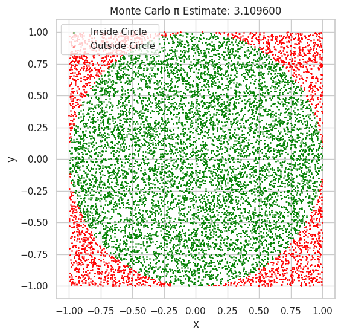
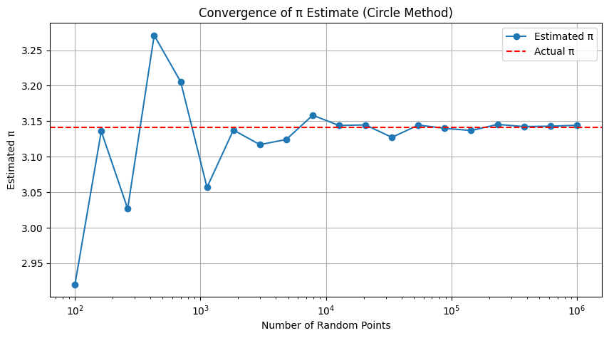

# Problem 2
# ✅ PART 1: Estimating π Using a Circle

## 1. Theoretical Foundation

### 🔹 Geometric Intuition Behind Estimating π

Monte Carlo simulation allows us to estimate π by randomly sampling points in a known geometric space. Here's the basic idea:

- Imagine a **unit circle** (radius $r=1$) centered at the origin.
- This circle fits **perfectly** inside a square with side length 2, extending from $-1$ to $1$ on both axes.
- The **area of the circle** is:
  $$
  A_{\text{circle}} = \pi r^2 = \pi (1)^2 = \pi
  $$
- The **area of the square** is:
  $$
  A_{\text{square}} = (2r)^2 = (2)^2 = 4
  $$
- The **ratio of the areas** is:
  $$
  \frac{A_{\text{circle}}}{A_{\text{square}}} = \frac{\pi}{4}
  $$

### 🔹 Using Random Points to Estimate π

We generate random points $(x, y)$ uniformly in the square $[-1, 1] \times [-1, 1]$.

- A point lies **inside the unit circle** if:
  $$
  x^2 + y^2 \leq 1
  $$
- Let:
  - $N$: total number of points generated  
  - $N_{\text{circle}}$: number of points inside the circle

- The ratio:
  $$
  \frac{N_{\text{circle}}}{N} \approx \frac{\text{Area of Circle}}{\text{Area of Square}} = \frac{\pi}{4}
  $$

### 🔹 Final Formula to Estimate π

Rearranging the above equation:
$$
\frac{N_{\text{circle}}}{N} \approx \frac{\pi}{4} \quad \Rightarrow \quad \pi \approx 4 \cdot \frac{N_{\text{circle}}}{N}
$$

### ✅ Summary

- By sampling random points in a square and counting how many fall inside the inscribed circle, we can estimate π.
- The more points we use, the better the approximation (due to the Law of Large Numbers).


# 🧪 PART 1: Simulation – Estimating π Using a Unit Circle

This section simulates the Monte Carlo method to estimate π.

We will:

- Generate random points in a square bounding the unit circle.
- Count how many points fall inside the circle.
- Estimate π using the formula:

$$
\pi \approx 4 \cdot \frac{N_{\text{circle}}}{N}
$$

# 🧪 PART 1: Simulation – Estimating π Using a Unit Circle

This section simulates the Monte Carlo method to estimate π.

We will:

- Generate random points in a square bounding the unit circle.
- Count how many points fall inside the circle.
- Estimate π using the formula:

$$
\pi \approx 4 \cdot \frac{N_{\text{circle}}}{N}
$$

## 🟢 Visualization

We now plot the points:
- **Green**: inside the circle  
- **Red**: outside the circle


```python
# Plotting
plt.figure(figsize=(6, 6))
plt.scatter(x[inside_circle], y[inside_circle], color='green', s=1, label='Inside Circle')
plt.scatter(x[~inside_circle], y[~inside_circle], color='red', s=1, label='Outside Circle')
plt.gca().set_aspect('equal')
plt.title(f"Monte Carlo π Estimate: {pi_estimate:.6f}")
plt.xlabel("x")
plt.ylabel("y")
plt.legend()
plt.grid(True)
plt.show()
````
