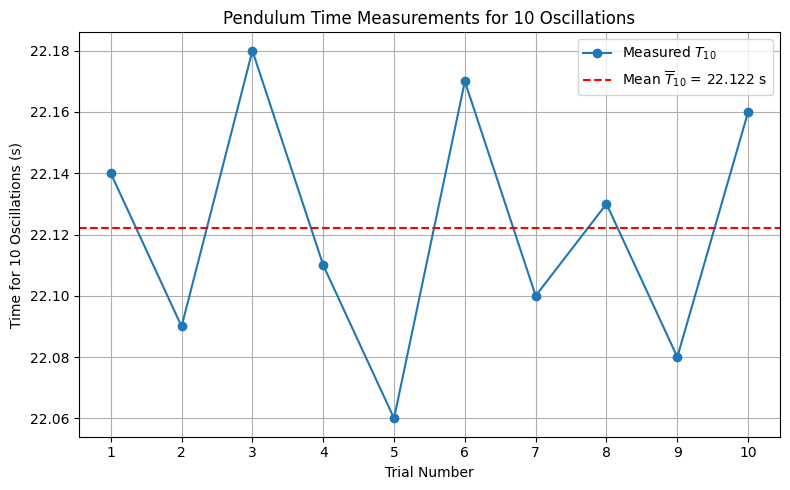

# Problem 1

# 📏 Measuring Earth's Gravitational Acceleration with a Pendulum

## 🔷 Theoretical Background

The acceleration due to gravity, denoted as $g$, is a fundamental physical constant influencing motion and structure in both classical and modern physics. One of the most reliable classical methods to determine $g$ involves analyzing the motion of a **simple pendulum**.

The period of a simple pendulum under the small-angle approximation ($\theta < 15^\circ$) is given by:

$$
T = 2\pi \sqrt{\frac{L}{g}} \quad \Rightarrow \quad g = \frac{4\pi^2 L}{T^2}
$$

Where:
- $T$ is the period of oscillation,
- $L$ is the length from the suspension point to the center of mass of the bob,
- $g$ is the local gravitational field strength.

---

## 🧪 Materials & Setup

### ✅ Materials Needed

- A **string** (~1 or 1.5 meters long)  
- A **small weight** (e.g., bag of coins, sugar, or a keychain)  
- A **stopwatch** or **smartphone timer**  
- A **ruler** or **measuring tape**  

---
# Measuring Earth's Gravitational Acceleration with a Pendulum

## 1. Experimental Setup

- **Pendulum Length (L):** 1.2 m  
- **Object Used as Weight:** 500 g salt pack  
- **Measuring Tool Resolution:** 1 mm  
- **Uncertainty in Length ($\Delta L$):** 0.0005 m (½ of 1 mm)

## 2. Time Measurements

Each value below represents the time for **10 complete oscillations** of the pendulum.

| Trial | Time for 10 Oscillations ($T_{10}$) [s] |
|-------|---------------------------|
| 1     | 22.14                     |
| 2     | 22.09                     |
| 3     | 22.18                     |
| 4     | 22.11                     |
| 5     | 22.06                     |
| 6     | 22.17                     |
| 7     | 22.10                     |
| 8     | 22.13                     |
| 9     | 22.08                     |
| 10    | 22.16                     |

- **Mean Time for 10 Oscillations ($\overline{T}_{10}$):** 22.122 s  

- **Standard Deviation ($\sigma_T$):** 0.041 s  

- **Uncertainty in Mean Time ($\Delta T_{10}$):** 0.013 s ($\sigma_T/\sqrt{10}$)

## 3. Period and Uncertainty

- **Period ($T$):**  

$$T=\frac{\overline{T}_{10}}{10}=\frac{22.122}{10}=2.212\ \text{s}$$

- **Uncertainty in Period ($\Delta T$):**  

$$\Delta T=\frac{\Delta T_{10}}{10}=\frac{0.013}{10}=0.0013\ \text{s}$$

## 4. Gravitational Acceleration Calculation

Using the formula:  

$$g=\frac{4\pi^2L}{T^2}$$

- $$g=\frac{4\pi^2\cdot1.2}{(2.212)^2}\approx9.65\ \text{m/s}^2$$

## 5. Uncertainty in $g$
Propagation of uncertainty:  

$$
\Delta g=g\cdot\sqrt{\left(\frac{\Delta L}{L}\right)^2+\left(2\cdot\frac{\Delta T}{T}\right)^2}
$$

- $$\frac{\Delta L}{L}=\frac{0.0005}{1.2}\approx0.00042$$  

- $$\frac{\Delta T}{T}=\frac{0.0013}{2.212}\approx0.00059$$  

- $$\Delta g\approx9.65\cdot\sqrt{(0.00042)^2+(2\cdot0.00059)^2}\approx0.011\ \text{m/s}^2$$

- **Final Result:**  

$$g=9.65\pm0.01\ \text{m/s}^2$$

## 6. Analysis

- The measured value of $g$ is slightly lower than the standard value (9.81 m/s²), which may be due to timing inaccuracies or slight deviations from the small-angle approximation.
- **Measurement resolution** affects $\Delta L$; finer rulers would reduce uncertainty.
- **Human reaction time** influences $\Delta T$, even when measuring 10 oscillations.
- **Assumptions made:**  
  - The pendulum swings in a perfect arc.  
  - Air resistance and friction at the pivot are negligible.  
  - The swing angle is less than 15°